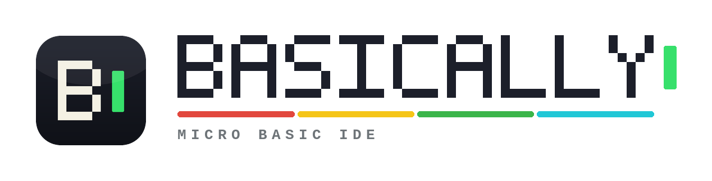

  <picture>
    <source media="(prefers-color-scheme: dark)" srcset="docs/public/logo-dark.png" />
    
  </picture>

A web IDE for microcomputer BASIC - write, run and ship games and programs for
real retro hardware from your browser.

Support includes the **Sinclair ZX81**, **ZX Spectrum**, **BBC
Micro**, among others.

  

## Features

- **Editor** — CodeMirror 6 with per-dialect BASIC syntax highlighting, keyword
  autocomplete (with per-keyword documentation), live tokenizer linting, and
  a byte counter against the target machine's RAM budget.
- **Built-in emulator** — a per-target emulator in TypeScript (a vendored Z80
  core drives the Sinclair machines; the BBC Micro embeds jsbeeb), running the
  real ROM with hardware-accurate display and keyboard. One click tokenizes
  your source to a machine image and flash-loads it through the ROM's own
  tape/load path.
- **AI code generation** — a chat panel backed by the Claude API (bring your
  own key, stored in your browser). Claude is given each machine's dialect
  rules (for the ZX81, that means one statement per line, mandatory LET, INKEY$
  game loops, PRINT AT) and generated programs land in your editor with one
  click (replace, merge by line number, or replace+run).
- **Two-way hardware transfer** (capabilities vary by machine) — export to the
  real machine _and_ import a program back off it: pull an old program from real
  hardware, edit and test it in the IDE, then export the updated version back —
  or carry changes made on the physical machine back into the editor.
  - **Cassette audio**: play the tape signal straight out of your speakers
    into the machine's EAR port, or download it as a `.wav` (export); record the
    machine's tape output, or drop in a `.wav`, and decode it back to editable
    source (import).
  - **Machine image** download (e.g. the ZX81 `.P` file for ZXpand and friends)
    and import of existing images back into editable text.
  - **WebSerial** push to a microcontroller bridge
    ([protocol spec](docs/reference/serial-protocol.md)).
- **Save/load `.bas`** with the File System Access API (download fallback),
  autosave to localStorage, and bundled sample games.
- **Installable PWA** — add Basically to your home screen and run it
  standalone. On phone-sized screens the UI is locked to portrait due to vertical screen size constraints; tablets and
  larger screens support both portrait and landscape.

## Writing BASIC (ZX81 example)

One numbered line per statement, keywords as words. Specials: block graphics
as unicode (`█▀▌▒`…) or escapes (`\::`), inverse video as `%A`, `**` for
power. See [docs/reference/file-formats.md](docs/reference/file-formats.md).

## Running on real hardware

Basically interfaces with real machines **both ways** — export a program to the
machine, or import one back off it into the editor.

**Export (IDE → machine):**

1. **Cassette**: connect your headphone jack to the aux socket, volume
   to max. On the machine run `LOAD ""` (or equiv.); in the IDE choose
   **⇥ Hardware ▸ Play through speakers**. Use _robust mode_ if loads fail.
2. **SD interfaces**: download the `.P` or `.TAP` file and copy it across.
3. **Serial bridge**: any microcontroller implementing the
   [bridge protocol](docs/reference/serial-protocol.md) can receive programs via
   WebSerial (Chrome/Edge).

**Import (machine → IDE):**

1. **Cassette**: `SAVE`/`CSAVE` on the machine into your device's mic / line-in
   (or save a `.wav`); Basically decodes the recording back to editable source.
2. **SD interfaces**: load an existing native image (`.P` / `.TAP` / `.prg` …)
   back into the editor.

See [docs/guide/hardware.md](docs/guide/hardware.md) for the full walkthrough.

## Community

Join the Discord to ask questions, get help, share what you've made, and follow
development: **[discord.gg/UCK3JPD6ck](https://discord.gg/UCK3JPD6ck)**. See the
[community page](docs/guide/community.md) for more.

## Contributing to the project

Support welcome! Please see the [contributing](docs/contributing/contributing.md) guide.

## ROM licensing

The bundled ROM images under `public/roms/` are third-party copyrighted works,
included unmodified solely for use with the built-in emulators — the Sinclair
ROMs under Amstrad's long-standing permission for emulator use, the Acorn ROMs
on the same de-facto basis as other BBC Micro emulators. Per-ROM copyright and
provenance is documented in
[ATTRIBUTION.md](public/roms/ATTRIBUTION.md).

## License

Copyright © 2026 Sean Hodges.

This project is licensed under the **GNU GPL v3.0 or later** — see
[LICENSE](LICENSE) and [ATTRIBUTION](public/roms/ATTRIBUTION.md).
