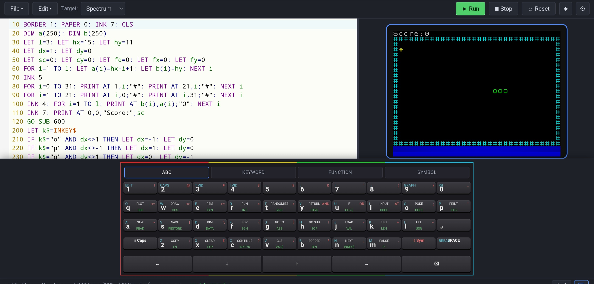

<p align="center">
  <picture>
    <source media="(prefers-color-scheme: dark)" srcset="docs/assets/logo-dark.png" />
    
  </picture>
</p>

# Basically

A web IDE for microcomputer BASIC dialects — write, run and ship games for
real retro hardware from your browser. It's built around a dialect abstraction:
each target machine plugs in its own tokenizer, emulator and hardware export, so
support grows over time rather than being fixed to a particular machine. Targets
that ship today include the **Sinclair ZX81**, **ZX Spectrum** and **BBC
Micro**, with more addable through the dialect interface. (Examples below use
the ZX81 for concreteness.)

<p align="center">
  
</p>

## Features

- **Editor** — CodeMirror 6 with per-dialect BASIC syntax highlighting, keyword
  autocomplete (with per-keyword documentation), live tokenizer linting, and
  a byte counter against the target machine's RAM budget.
- **Built-in emulator** — a per-target emulator in TypeScript (a vendored Z80
  core drives the Sinclair machines; the BBC Micro embeds jsbeeb), running the
  real ROM with hardware-accurate display and keyboard. One click tokenizes
  your source to a machine image and flash-loads it through the ROM's own
  tape/load path.
- **AI code generation** — a chat panel backed by the Claude API (bring your
  own key, stored only in your browser). Claude is given each machine's dialect
  rules (for the ZX81, that means one statement per line, mandatory LET, INKEY$
  game loops, PRINT AT) and generated programs land in your editor with one
  click (replace, merge by line number, or replace+run).
- **Real hardware transfer** (capabilities vary by machine)
  - **Cassette audio**: play the tape signal straight out of your speakers
    into the machine's EAR port, or download it as a `.wav`.
  - **Machine image** download (e.g. the ZX81 `.P` file for ZXpand and friends)
    and import of existing images back into editable text.
  - **WebSerial** push to a microcontroller bridge
    ([protocol spec](docs/serial-protocol.md)).
- **Save/load `.bas`** with the File System Access API (download fallback),
  autosave to localStorage, and bundled sample games.
- **Installable PWA** — add Basically to your home screen and run it
  standalone. On phone-sized screens the UI is locked to portrait; tablets and
  larger screens support both portrait and landscape.

## Getting started

```sh
npm install
npm run dev    # IDE on http://localhost:5173
npm test       # unit tests, incl. booting the emulator ROM
npm run build  # static site in dist/ (deployable to GitHub Pages)
```

Open the IDE, pick **File ▸ Samples ▸ Breakout**, press **▶ Run** (or
Ctrl+Enter), click the screen and play with the 5 and 8 keys.

For AI generation, click **✦ AI**, add your Anthropic API key (created at
[platform.claude.com](https://platform.claude.com/)), and ask for a game.

## Writing BASIC (ZX81 example)

One numbered line per statement, keywords as words. Specials: block graphics
as unicode (`█▀▌▒`…) or escapes (`\::`), inverse video as `%A`, `**` for
power. See [docs/file-formats.md](docs/file-formats.md).

## Running on real hardware (ZX81 example)

1. **Cassette**: connect your headphone jack to the ZX81 EAR socket, volume
   to max. On the ZX81 type `LOAD ""` and press NEW LINE; in the IDE choose
   **⇥ Hardware ▸ Play through speakers**. Use _robust mode_ if loads fail.
2. **ZXpand / SD interfaces**: download the `.P` file and copy it across.
3. **Serial bridge**: any microcontroller implementing the
   [bridge protocol](docs/serial-protocol.md) can receive programs via
   WebSerial (Chrome/Edge).

## Project layout

```
src/dialects/types.ts      the Dialect interface — the contract for a machine
src/dialects/zx81/         everything ZX81: charset, tokenizer, .P builder,
                           emulator, cassette encoder, AI profile
src/dialects/zxspectrum/   ZX Spectrum dialect + emulator
src/dialects/bbcmicro/     BBC Micro dialect (embeds the jsbeeb emulator)
src/emulator/z80/          vendored MIT Z80 core (Molly Howell) + patches
src/editor/                generic CM6 language/completion/lint builders
src/ai/                    Claude API client, prompt builder, code extractor
src/transfer/              WAV writer, audio player, WebSerial, protocol
docs/adding-a-dialect.md   how to add the next machine
```

## ROM licensing

The bundled ROM images under `public/roms/` are third-party copyrighted works,
included unmodified solely for use with the built-in emulators — the Sinclair
ROMs under Amstrad's long-standing permission for emulator use, the Acorn ROMs
on the same de-facto basis as other BBC Micro emulators. Per-ROM copyright and
provenance is documented in
[public/roms/ATTRIBUTION.md](public/roms/ATTRIBUTION.md).

## License

This project is licensed under the **GNU GPL v3.0 or later** — see
[LICENSE](LICENSE). It embeds the
[jsbeeb](https://github.com/mattgodbolt/jsbeeb) emulator
(© Matt Godbolt and contributors, GPL-3.0-or-later), which is what places the
combined work under the GPL. The vendored Z80 core
(`src/emulator/z80/`, MIT, © Molly Howell) keeps its own GPL-compatible
license. ROM images are third-party copyrighted works — see
[public/roms/ATTRIBUTION.md](public/roms/ATTRIBUTION.md).
