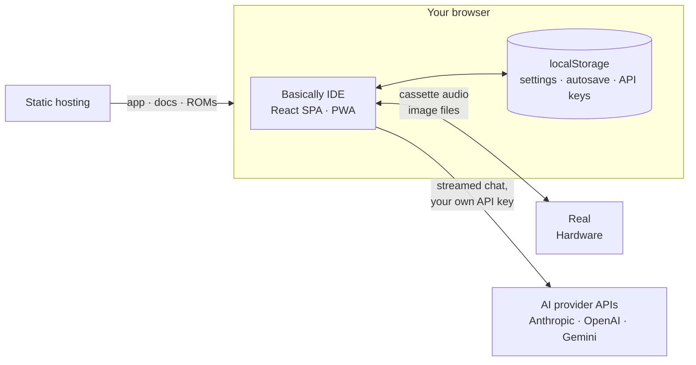
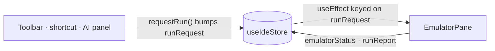
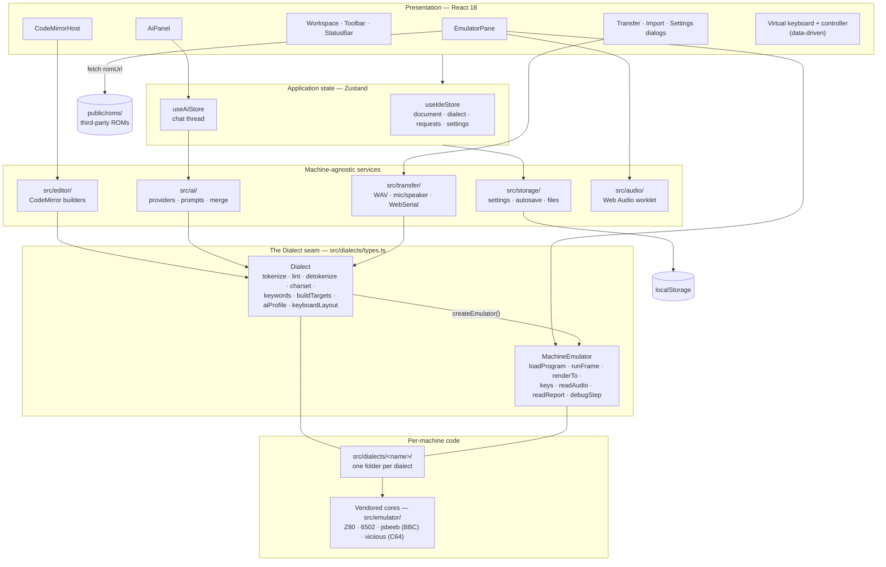
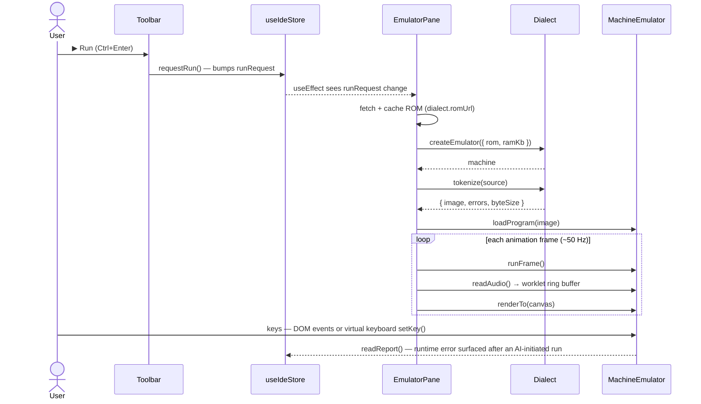
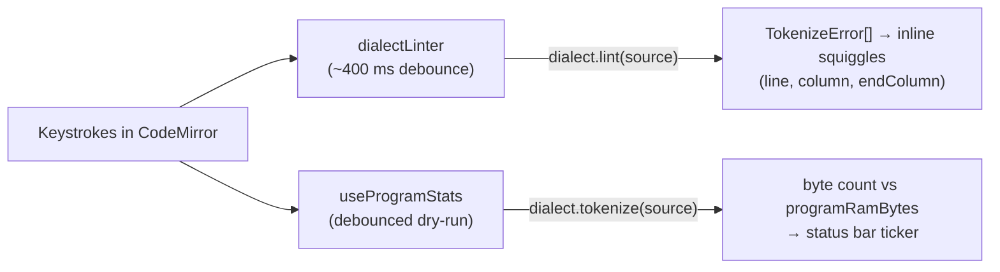
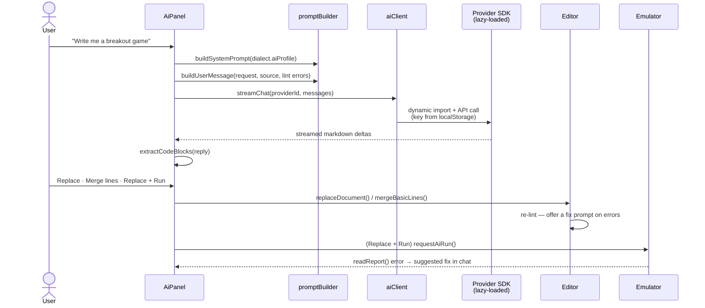
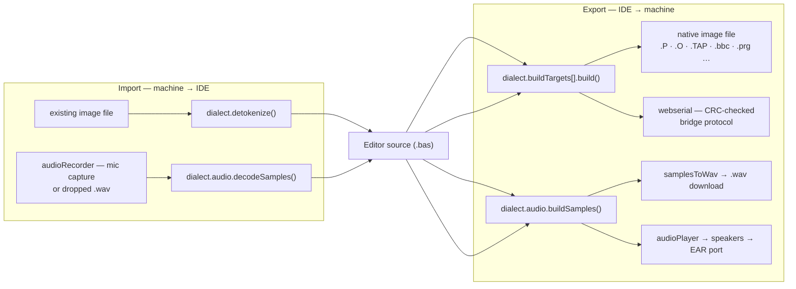

# Architecture

This page is the map of how Basically is put together: the system layers, the
boundaries between them, and how data moves through the app when you edit, run,
generate, and ship a program. Read it alongside the
[contributing guide](/contributing/contributing); if you are adding a whole new
machine, continue to [Adding a dialect](/contributing/adding-a-dialect)
afterwards.

## The system at a glance

Basically is a **fully client-side single-page application**. There is no
backend, no server-side state, and no account system: the IDE (a Vite + React
SPA) and this documentation site (VitePress) are built into one static artifact
and served from static hosting. Everything — the editors, the tokenizers, the
CPU emulators, the cassette-audio codecs — runs in your browser, and both the
IDE and the docs are installable PWAs that work offline.

Only three things ever cross the network:

1. **Static assets** — the app itself and the machine ROMs under
   `public/roms/`, fetched from the same origin (and precached by the service
   worker).
2. **AI chat** — streamed HTTPS calls from the browser directly to the AI
   provider you configured (Anthropic, OpenAI, or Gemini), authenticated with
   your own API key. The key lives in `localStorage` and is sent nowhere else.
3. **Hardware transfer** — cassette audio through your speakers and microphone, 
   downloaded image files, or a WebSerial connection to a microcontroller bridge.

## System components

Because there is no server, the classic presentation / business-logic / data
split maps onto in-browser layers. The load-bearing boundary is the **`Dialect`
seam** (`src/dialects/types.ts`): the app only ever talks to the `Dialect`
interface and the `MachineEmulator` it creates — never to a machine's
specifics directly. Everything above the seam is machine-agnostic; everything
below it is one machine's private business.

### Presentation layer — React 18 (`src/components/`, `src/keyboard/`)

The UI shell. `Workspace` owns the editor/emulator split (tabs on mobile),
`CodeMirrorHost` wraps the CodeMirror 6 editor, `EmulatorPane` hosts the
canvas and drives the run loop, `AiPanel` is the chat surface, and `Toolbar` /
`StatusBar` carry the menus, dialect selector, and the byte-budget ticker.
Dialogs handle transfer, import, settings, and the dialect switch
confirmation. The virtual keyboard and game controller (`src/keyboard/`) are
**pure data-driven renderers**: each dialect supplies a `KeyboardLayout`
object (layers, key legends, glyphs, matrix tokens) and the keyboard code
itself contains no per-machine logic.

### Application state layer — Zustand (`src/app/`)

A single store, `useIdeStore` (`src/app/store.ts`), holds the document
(source, file name, dirty flag), the active dialect, emulator status,
breakpoints, panel/dialog visibility, and every user setting. Components
subscribe through narrow selectors (`useIdeStore((s) => s.source)`). A second
small store, `useAiStore` (`src/ai/aiStore.ts`), holds the chat thread.

Cross-module commands use a **bump-a-counter pattern** instead of shared
handles: to run a program the toolbar bumps `runRequest`, and a `useEffect` in
`EmulatorPane` keyed on that counter reacts. The same shape (`stopRequest`,
`resetRequest`, `stepRequest`, `docOverride`, `jumpTarget`, …) carries every
one-shot imperative command, which keeps modules decoupled and state
serialisable.

### Language toolchain — the `Dialect` seam (`src/dialects/`)

The domain layer. `registry.ts` exposes the available dialects
(`getDialect(id)` — Sinclair, Acorn, Commodore, Tandy machines and counting;
the registry is the source of truth for what ships). Each dialect folder
provides, behind the one interface:

- **`tokenize` / `detokenize`** — editor text ⇄ program bytes plus a full
  loadable machine image. Errors are collected as `TokenizeError[]` (1-based
  line, 0-based column) for inline display, never thrown.
- **`lint`** — a tokenizer dry-run for as-you-type diagnostics.
- **`charset`** — unicode block graphics and escapes ⇄ machine codes.
- **`keywords`** and **`languageSupport()`** — feed the generic editor
  highlighting and autocomplete.
- **`buildTargets`**, **`binaryImports`**, and **`audio`** — hardware export
  and import capabilities.
- **`aiProfile`** — the machine-specific system prompt for the AI assistant.
- **`keyboardLayout`**, **`samples`**, **`programRamBytes`**, and
  **`createEmulator()`**.

### Emulation layer (`src/dialects/<name>/emulator/`, `src/emulator/`)

`Dialect.createEmulator()` returns a `MachineEmulator`: `loadProgram(image)`,
`runFrame()` (one 50 Hz frame of CPU time), `renderTo(canvas)`, key and
joystick input, and optional capabilities the app feature-detects per machine
— `readAudio()`, `readVariables()`, `readReport()` (BASIC runtime errors), and
`debugStep()` for the line-level debugger. Small self-contained machines live
inside their dialect folder; large or vendored cores live under
`src/emulator/` — the Z80 core shared by the Sinclair machines, a 6502 core,
the jsbeeb wrapper for the BBC machines, and the viciious core for the C64.
The vendored cores are third-party code and are not hand-edited (see
[Don't touch](/contributing/contributing#don-t-touch)).

### Editor services (`src/editor/`)

Generic CodeMirror 6 builders parameterised entirely by the `Dialect`
interface: a `StreamLanguage` highlighter built from the dialect's keyword
table, keyword/variable/construct completion sources, the lint bridge
(`dialectLinter` wraps `dialect.lint()` into CodeMirror diagnostics), line
numbering and renumbering, and the program outline. Nothing in this folder
knows about any specific machine.

### Integration services

- **AI (`src/ai/`)** — a provider registry with three lazy-loaded backends
  (Anthropic, OpenAI, Gemini SDKs, code-split behind dynamic `import()`), a
  dispatcher (`aiClient.ts`) exposing one `streamChat()` regardless of
  provider, a prompt builder that combines the dialect's `aiProfile` with the
  current source and lint errors, and a code extractor/merger that lands
  generated BASIC back in the editor.
- **Transfer (`src/transfer/`)** — WAV packing (`wav.ts`), speaker playback
  and microphone capture (`audioPlayer.ts` / `audioRecorder.ts`), and the
  CRC-checked WebSerial bridge (`protocol.ts` / `webserial.ts`, spec in
  [Serial bridge protocol](/reference/serial-protocol)). The actual cassette
  encoding/decoding and native image formats are per-dialect, reached through
  the seam.
- **Emulator audio (`src/audio/`)** — a Web Audio `AudioWorklet` ring buffer;
  each frame the run loop pumps `machine.readAudio()` into it.
- **Storage (`src/storage/`)** — typed `localStorage` accessors under the
  `mbide.*` namespace (settings, autosave, AI conversation, API keys) and File
  System Access helpers with a download fallback.

### Layer diagram

### Third-party libraries

| Library                                        | Role                                                                     |
| ---------------------------------------------- | ------------------------------------------------------------------------ |
| React 18 + Zustand 5                           | UI and state                                                             |
| CodeMirror 6                                   | Editor: language, autocomplete, lint, search                             |
| `@anthropic-ai/sdk`, `openai`, `@google/genai` | AI provider backends (lazy-loaded)                                       |
| jsbeeb                                         | BBC Micro/Master core, wrapped by `src/emulator/bbc/`                    |
| viciious, Z80 core, 6502 core                  | Vendored emulator cores under `src/emulator/` (see licences/attribution) |
| Vite 6 + `vite-plugin-pwa`                     | Build, dev server, PWA/service worker                                    |
| VitePress                                      | This documentation site                                                  |
| Vitest 3 + Playwright                          | Unit and end-to-end/visual tests                                         |

## Data flow

### Running a program

The core loop of the IDE. Pressing **▶ Run** bumps `runRequest` in the store;
`EmulatorPane` reacts, builds the machine if needed, tokenizes the current
source into a full memory image, and flash-loads it the same way the real ROM
would load from tape. The build step is dialect-specific (`.P`, `.O`, `.TAP`,
raw BBC bytes, `.prg`, …) but the shape is identical for every machine.

Step by step:

1. **Edit** — CodeMirror is the source of truth for the text; the store keeps
   a mirror (`source`) and a dirty flag. Pushing text _into_ the editor (file
   open, AI apply, dialect switch) goes through a `docOverride` sequence value
   rather than a direct handle.
2. **Request** — `requestRun()` bumps the `runRequest` counter.
3. **Build the machine** — on first run for a dialect, `EmulatorPane` fetches
   and caches the ROM, then calls `dialect.createEmulator()`.
4. **Tokenize** — `dialect.tokenize(source)` produces the program bytes, the
   full loadable image, the byte size for the RAM budget, and any errors.
5. **Load and run** — `machine.loadProgram(image)`, then a
   `requestAnimationFrame` loop calls `runFrame()`, pumps audio, and paints
   the canvas each frame. In debug mode the loop calls `debugStep()` instead,
   pausing on breakpoints at BASIC-line granularity.

### Editing and linting

While you type, two debounced consumers run the tokenizer as a dry-run — no
machine involved:

### AI code generation

The AI path runs parallel to the run path and meets it in two places: lint
errors flow into the prompt, and runtime errors flow back into the chat.

Key details:

- The system prompt is the dialect's `aiProfile.systemPrompt` — byte-stable
  per dialect so provider-side prompt caching works. It teaches the model the
  machine's rules (for the ZX81: one statement per line, mandatory `LET`,
  `PRINT AT`, …).
- The user message embeds the current program and up to 20 tokenizer errors.
- `mergeBasicLines()` merges generated code by BASIC line number: matching
  line numbers replace, new ones insert in order.
- After **Replace + Run**, the run loop polls `machine.readReport()` for a few
  seconds; a genuine runtime error (not OK/STOP/BREAK) is fed back to the chat
  as a one-click fix request.

### Hardware transfer — export and import

Transfer is two-way. Every path funnels through the seam: the dialect owns the
byte formats and cassette codecs, while `src/transfer/` owns the
machine-agnostic plumbing (WAV container, speaker/mic, serial framing).

### Persistence

All persistence is `localStorage`, namespaced `mbide.*`, via typed accessors
in `src/storage/settings.ts`:

| What                       | When                                                        |
| -------------------------- | ----------------------------------------------------------- |
| Document autosave (+ name) | Every 2 s while the document is dirty                       |
| AI conversation            | Throttled (~1 s) while a reply streams                      |
| Settings                   | On change (dialect, editor, emulator, keyboard, controller) |
| AI provider + API keys     | On entry in the AI settings dialog; per-provider keys       |

Saving and opening `.bas` files uses the File System Access API where
available, with a download/upload fallback (`src/storage/files.ts`).

## Where to go next

- [Contributing guide](/contributing/contributing) — setup, conventions, and
  the PR workflow.
- [Adding a dialect](/contributing/adding-a-dialect) — the step-by-step guide
  to bringing up a new machine behind the seam.
- [File formats](/reference/file-formats) and the
  [serial bridge protocol](/reference/serial-protocol) — the byte-level
  contracts the transfer layer implements.
