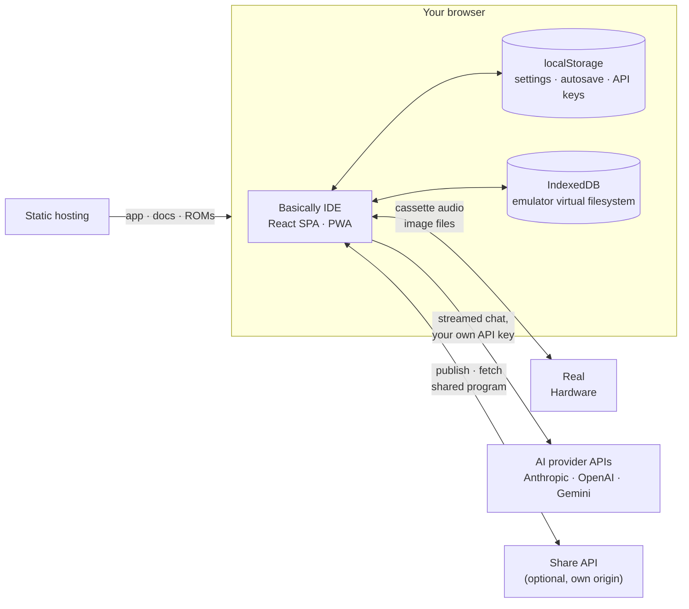
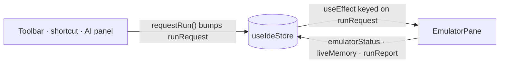
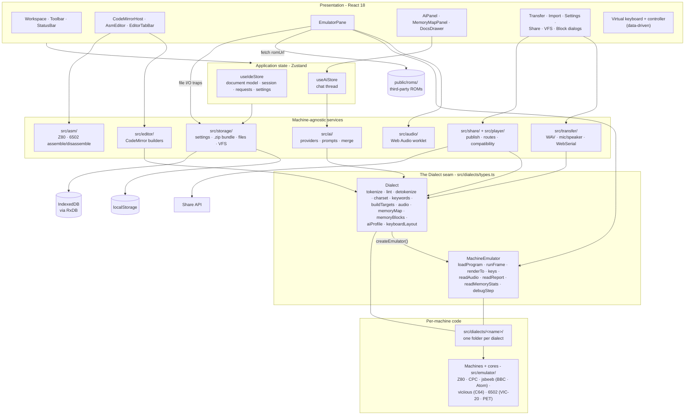
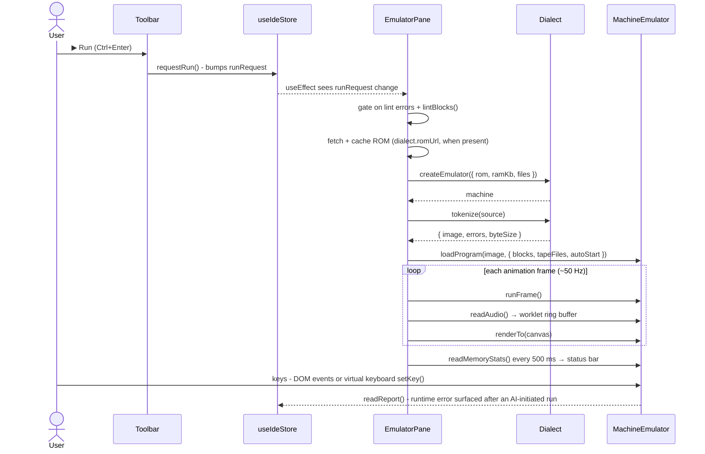
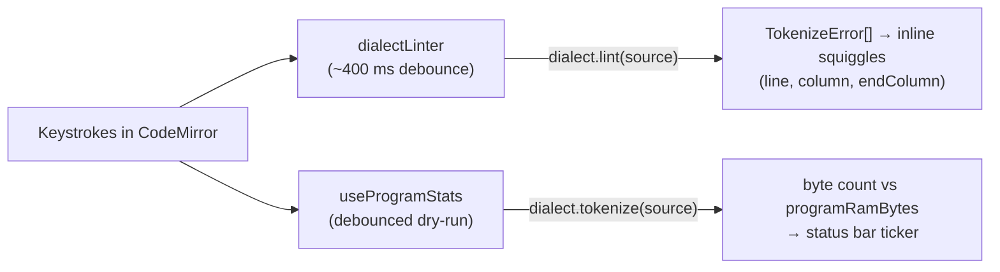
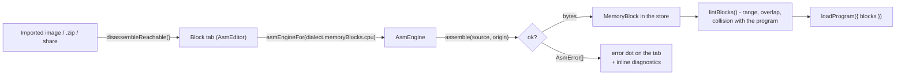
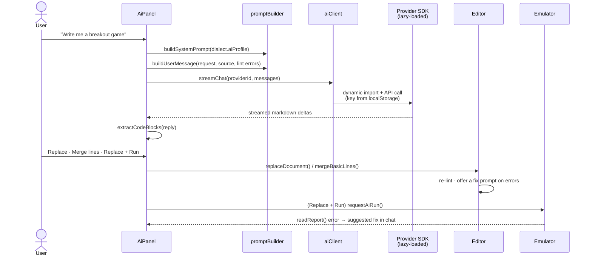
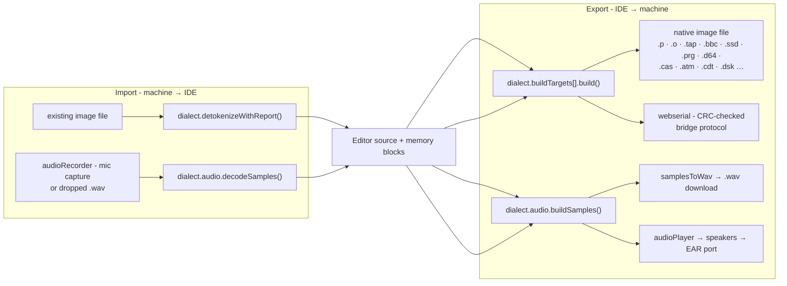

# Architecture

This page is the map of how Basically is put together: the system layers, the
boundaries between them, and how data moves through the app when you edit,
assemble, run, generate, and ship a program. Read it alongside the
[contributing guide](/contributing/contributing); if you are adding a whole new
machine, continue to [Adding a dialect](/contributing/adding-a-dialect)
afterwards.

## The system at a glance

Basically is a **client-side single-page application**. There is no application
server, no server-side session, and no account system: the IDE (a Vite + React
SPA) and this documentation site (VitePress) are built into one static artifact
and served from static hosting. Everything - the editors, the tokenizers, the
assemblers, the CPU emulators, the cassette-audio codecs - runs in your browser,
and both the IDE and the docs are installable PWAs that work offline. The docs
are served from `/docs/` next to the app, which lets the IDE embed them in an
in-app drawer rather than sending you to another tab.

Only four things ever cross the network, and three of them are optional:

1. **Static assets** - the app, the docs, and the machine ROMs under
   `public/roms/`, fetched from the same origin (and precached by the service
   worker; ROMs are cached at runtime on first use).
2. **AI chat** - streamed HTTPS calls from the browser directly to the AI
   provider you configured (Anthropic, OpenAI, or Gemini), authenticated with
   your own API key. The key lives in `localStorage` and is sent nowhere else.
3. **Share links** - the one first-party service. Publishing a program POSTs it
   to the share API (its own origin; the wire contract and deployment live in a
   separate repo), which returns a six-character id behind a short player URL.
   The base URL comes from `VITE_SHARE_API_URL` at build time - a build without
   it degrades gracefully and the publish UI reports "not configured" instead of
   firing doomed requests.
4. **Hardware transfer** - cassette audio through your speakers and microphone,
   downloaded image files, or a WebSerial connection to a microcontroller bridge.

```mermaid
flowchart LR
  subgraph browser ["Your browser"]
    ide["Basically IDE<br/>React SPA · PWA"]
    ls[("localStorage<br/>settings · autosave · API keys")]
    idb[("IndexedDB<br/>emulator virtual filesystem")]
    ide <--> ls
    ide <--> idb
  end

  host["Static hosting"] -->|"app · docs · ROMs"| browser
  ide <-->|"cassette audio <br/> image files"| hw["Real<br/>Hardware"]
  ide -->|"streamed chat,<br/>your own API key"| ai["AI provider APIs<br/>Anthropic · OpenAI · Gemini"]
  ide <-->|"publish · fetch<br/>shared program"| share["Share API<br/>(optional, own origin)"]
```

## System components

Because there is no application server, the classic presentation /
business-logic / data split maps onto in-browser layers. The load-bearing
boundary is the **`Dialect` seam** (`src/dialects/types.ts`): the app only ever
talks to the `Dialect` interface and the `MachineEmulator` it creates - never to
a machine's specifics directly. Everything above the seam is machine-agnostic;
everything below it is one machine's private business.

### Presentation layer - React 18 (`src/components/`, `src/keyboard/`)

The UI shell. `Workspace` owns the editor/monitor split (tabs on phones, with a
dedicated landscape layout), `CodeMirrorHost` wraps the CodeMirror 6 BASIC
editor, `AsmEditor` is the sibling editor for a memory block's assembly source,
and `EditorTabBar` switches between the BASIC source and each block. In the
right-hand column `EmulatorPane` hosts the canvas and drives the run loop, while
`AiPanel`, `MemoryMapPanel`, and the docs drawer take over that slot when
opened. `Toolbar` / `StatusBar` carry the menus, target machine control, and the
byte-budget ticker; `MobileTabBar` does the same job on a phone.

Dialogs cover transfer/export, import, settings, publishing a share link, the
emulator-filesystem inspector, the program outline, block settings and deletion,
the target-switch confirmation, the first-launch welcome, and `NewProjectDialog`

- the single place a program starts, carrying the machine picker (grouped by
  manufacturer), the project name and the starting point (blank, a bundled sample,
  or a description handed to the AI panel). Nothing is ever loaded implicitly:
  there is no "starter" sample, so a first launch and an empty-editor target
  switch both leave the editor empty. `DocsDrawer`
  embeds this documentation site from `/docs/` in an iframe and talks to it over
  `postMessage` (close, and the Compare page's "explain"/"convert" hand-offs into
  the AI panel).

The virtual keyboard and game controller (`src/keyboard/`) are **pure
data-driven renderers**: each dialect supplies a `KeyboardLayout` object
(layers, key legends, glyphs, matrix tokens) and the keyboard code itself
contains no per-machine logic.

### Application state layer - Zustand (`src/app/`)

A single store, `useIdeStore` (`src/app/store.ts`), holds three kinds of state:

- **The document model** - source text, file name, dirty flag, memory blocks,
  listing-block overrides, preserved tape files, an imported auto-start line,
  and (for a disc image that won't decompose) a verbatim boot disc. Everything
  in this group survives autosave and Save/Open together, and is reset as a unit
  whenever a _different_ program becomes active (New project, Open, Import,
  target switch, player boot).
- **Session state** - active dialect, emulator status, live memory figures,
  breakpoints and the paused debug line, block assembly errors.
- **Settings and UI** - panel/dialog visibility, split ratio, and every
  persisted user preference.

Components subscribe through narrow selectors (`useIdeStore((s) => s.source)`).
A second small store, `useAiStore` (`src/ai/aiStore.ts`), holds the chat thread.

Cross-module commands use a **bump-a-counter pattern** instead of shared
handles: to run a program the toolbar bumps `runRequest`, and a `useEffect` in
`EmulatorPane` keyed on that counter reacts. The same shape (`stopRequest`,
`resetRequest`, `stepRequest`, `continueRequest`, `docOverride`, `aiResetSeq`,
…) carries every one-shot imperative command, which keeps modules decoupled and
state serialisable.

```mermaid
flowchart LR
  src["Toolbar · shortcut · AI panel"] -->|"requestRun() bumps runRequest"| store[("useIdeStore")]
  store -->|"useEffect keyed on runRequest"| ep["EmulatorPane"]
  ep -->|"emulatorStatus · liveMemory · runReport"| store
```

### Language toolchain - the `Dialect` seam (`src/dialects/`)

The domain layer. `registry.ts` exposes the available dialects (`getDialect(id)`
throws on an unknown id, `findDialect(id)` returns `undefined` - Sinclair,
Acorn, Commodore, Tandy and Amstrad machines and counting; the registry is the
source of truth for what ships). Each dialect folder provides, behind the one
interface:

- **`tokenize` / `detokenize`** - editor text ⇄ program bytes plus a full
  loadable machine image. Errors are collected as `TokenizeError[]` (1-based
  line, 0-based column) for inline display, never thrown. An importer that can
  detect lossy round-trips grows `detokenizeWithReport` alongside.
- **`lint`** - a tokenizer dry-run for as-you-type diagnostics.
- **`charset`** - unicode block graphics and escapes ⇄ machine codes.
- **`keywords`**, **`languageSupport()`** and **`completionSource`** - feed the
  generic editor highlighting and autocomplete.
- **`buildTargets`**, **`binaryImports`**, and **`audio`** - hardware export
  and import capabilities, including cassette encode/decode.
- **`aiProfile`** - the machine-specific system prompt for the AI assistant.
- **`memoryMap`**, **`memoryBlocks`**, **`addressNotation`** and
  **`memoryWrites`** - what the memory-map viewer draws, and where machine-code
  blocks may legally live.
- **`keyboardLayout`**, **`samples`**, **`programRamBytes`**, and
  **`createEmulator()`**.
- Capability flags the UI feature-detects on: **`romUrl`** (absent for a machine
  that needs no ROM image), **`debuggable`**, **`joystickModes`**,
  **`supportsBinaryLines`**, **`displaySize`**, and **`docsReference`** (the
  slug of the dialect's reference page, for machines that share one).

### Emulation layer (`src/dialects/<name>/emulator/`, `src/emulator/`)

`Dialect.createEmulator()` returns a `MachineEmulator`: `loadProgram(image,
opts)`, `runFrame()` (one 50 Hz frame of CPU time), `renderTo(canvas)`, key and
joystick input, `setSpeed()`, and `dispose()`. Everything beyond that is an
**optional capability the app feature-detects per machine** - `readAudio()`,
`readVariables()`, `readReport()` (BASIC runtime errors), `readMemoryStats()`,
the memory-activity tap (`setMemoryActivityRecording()` /
`drainMemoryActivity()`) behind the memory-map overlay, and
`currentLine()` / `debugStep()` for the line-level debugger.

`loadProgram`'s options carry the rest of the document model into the machine:
memory blocks written straight into RAM, extra tape files mounted on the virtual
tape, an auto-start line, or a boot disc that supersedes all of them and boots
verbatim. `createEmulator` also receives a `MachineFileStore` - the emulator
virtual filesystem a running program's file I/O lands in.

Where the machine code lives depends on its size and provenance:

| Machine                       | Core                                                                                                                                                 |
| ----------------------------- | ---------------------------------------------------------------------------------------------------------------------------------------------------- |
| ZX80 · ZX81 · Spectrum 48/128 | In-dialect machines over the vendored Z80 core (`src/emulator/z80/`)                                                                                 |
| Amstrad CPC                   | `src/emulator/cpc/` - in-tree gate array, CRTC, PPI and display over the Z80 core                                                                    |
| BBC Micro · Master            | `src/emulator/bbc/` - an adapter around the jsbeeb npm package                                                                                       |
| Acorn Atom                    | `src/emulator/atom/` - jsbeeb's 6502, video and sound chips, Atom bus                                                                                |
| Commodore 64                  | `src/emulator/c64/` - around the vendored viciious core                                                                                              |
| VIC-20 · PET                  | `src/emulator/vic20/`, `src/emulator/pet/` - in-tree buses over the vendored 6502 core                                                               |
| TRS-80 (Level II BASIC)       | A first-party ROM-free high-level interpreter in `src/dialects/trs80/interpreter/`; a Z80 + ROM machine sits beside it as an alternate accuracy mode |

Shared hardware modules sit alongside: the AY-3-8912 sound chip
(`src/emulator/ay/`, used by the Spectrum 128 and the CPC), the Commodore 6522
VIA / 6520 PIA and character renderer (`src/emulator/commodore/`), and the
jsbeeb memory-activity tap. The vendored cores are third-party code and are not
hand-edited (see [Don't touch](/contributing/contributing#don-t-touch)).

### Assembler layer (`src/asm/`)

First-party paired assembler/disassembler engines - one per CPU (`z80`, `6502`)

- behind an `AsmEngine` interface, looked up with `asmEngineFor(cpu)`. A single
  instruction table per CPU drives both directions, so a block's bytes disassemble
  to text the assembler turns back into byte-identical bytes. `disassemble()`
  tiles every byte linearly; `disassembleReachable()` follows control flow from
  the block's entry point and emits unreachable bytes as `DB` rather than
  mis-decoding data as code. Assembly follows the house style: diagnostics are
  collected as `AsmError[]` (the same 1-based-line shape as `TokenizeError`),
  never thrown.

### Editor services (`src/editor/`)

Generic CodeMirror 6 builders parameterised entirely by the `Dialect`
interface: a `StreamLanguage` highlighter built from the dialect's keyword
table, keyword/variable/construct completion sources, the lint bridge
(`dialectLinter` wraps `dialect.lint()` into CodeMirror diagnostics), line
numbering and renumbering, the program outline, POKE-address detection that
feeds the memory-map viewer's markers, and the collapsed chips that stand in for
`#BIN` binary lines. A `CrunchMatcher` facet handles the Microsoft-BASIC
dialects, whose ROM tokenizers ignore spaces and match the longest keyword at
every position (`POKEA,10` is `POKE A,10`). Nothing in this folder knows about
any specific machine.

### Integration services

- **AI (`src/ai/`)** - a provider registry with three lazy-loaded backends
  (Anthropic, OpenAI, Gemini SDKs, code-split behind dynamic `import()`), a
  dispatcher (`aiClient.ts`) exposing one `streamChat()` regardless of
  provider, a prompt builder that combines the dialect's `aiProfile` with the
  current source and lint errors, and a code extractor/merger that lands
  generated BASIC back in the editor.
- **Transfer (`src/transfer/`)** - WAV packing (`wav.ts`), speaker playback
  and microphone capture (`audioPlayer.ts` / `audioRecorder.ts`), and the
  CRC-checked WebSerial bridge (`protocol.ts` / `webserial.ts`, spec in
  [Serial bridge protocol](/reference/serial-protocol)). The actual cassette
  encoding/decoding and native image formats are per-dialect, reached through
  the seam.
- **Share and player (`src/share/`, `src/player/`)** - `shareClient.ts` is the
  API client for publishing and fetching a shared program (source plus any
  memory blocks); `compatibility.ts` runs the syntactic check that decides which
  _other_ dialects a program can also open under. `routes.ts` maps a short URL
  to a machine and share id - `/<verb>/<id>`, where every verb is a real keyword
  from that machine's own BASIC (`/load/` for the ZX81, `/run/` for the C64) -
  and stays dependency-free so the share backend can bundle it to validate
  dialect ids. `PlayerApp.tsx` is the emulator-only shell those URLs boot.
- **Emulator audio (`src/audio/`)** - a Web Audio `AudioWorklet` ring buffer;
  each frame the run loop pumps `machine.readAudio()` into it.
- **Storage (`src/storage/`)** - typed `localStorage` accessors under the
  `mbide.*` namespace (settings, autosave, AI conversation, API keys), the
  `.zip` project-bundle codec (`projectFile.ts`), File System Access helpers
  with a download fallback (`files.ts`), and the emulator virtual filesystem
  (`vfs/`).

### The emulator virtual filesystem (`src/storage/vfs/`)

Where a running program's data file I/O lands when a machine traps it (Spectrum
tape `CODE`/`DATA` blocks, TRS-80 sequential files…). The authoritative store is
a **synchronous in-memory map** - ROM traps fire between CPU instructions and
cannot await - and every mutation is mirrored fire-and-forget into IndexedDB via
RxDB so the inspector dialog can watch the files reactively. RxDB is imported
dynamically, so it loads as an async chunk on first VFS use rather than in the
main bundle. The IDE clears the store on every emulator start and stop; a
breakpoint pause does not.

### Layer diagram

```mermaid
flowchart TB
  subgraph presentation ["Presentation - React 18"]
    workspace["Workspace · Toolbar · StatusBar"]
    editorui["CodeMirrorHost · AsmEditor · EditorTabBar"]
    emupane["EmulatorPane"]
    panels["AiPanel · MemoryMapPanel · DocsDrawer"]
    dialogs["Transfer · Import · Settings ·<br/>Share · VFS · Block dialogs"]
    vkbd["Virtual keyboard + controller<br/>(data-driven)"]
  end

  subgraph state ["Application state - Zustand"]
    store["useIdeStore<br/>document model · session · requests · settings"]
    aistore["useAiStore<br/>chat thread"]
  end

  subgraph services ["Machine-agnostic services"]
    editor["src/editor/<br/>CodeMirror builders"]
    asm["src/asm/<br/>Z80 · 6502 assemble/disassemble"]
    ai["src/ai/<br/>providers · prompts · merge"]
    transfer["src/transfer/<br/>WAV · mic/speaker · WebSerial"]
    shareapi["src/share/ + src/player/<br/>publish · routes · compatibility"]
    storage["src/storage/<br/>settings · .zip bundle · files · VFS"]
    audio["src/audio/<br/>Web Audio worklet"]
  end

  subgraph seam ["The Dialect seam - src/dialects/types.ts"]
    dialect["Dialect<br/>tokenize · lint · detokenize · charset · keywords ·<br/>buildTargets · audio · memoryMap · memoryBlocks ·<br/>aiProfile · keyboardLayout"]
    machine["MachineEmulator<br/>loadProgram · runFrame · renderTo · keys ·<br/>readAudio · readReport · readMemoryStats · debugStep"]
  end

  subgraph machines ["Per-machine code"]
    folders["src/dialects/&lt;name&gt;/<br/>one folder per dialect"]
    cores["Machines + cores - src/emulator/<br/>Z80 · CPC · jsbeeb (BBC · Atom) ·<br/>viciious (C64) · 6502 (VIC-20 · PET)"]
  end

  roms[("public/roms/<br/>third-party ROMs")]
  ls[("localStorage")]
  idb[("IndexedDB<br/>via RxDB")]
  api["Share API"]

  presentation --> state
  editorui --> editor
  editorui --> asm
  panels --> aistore --> ai
  dialogs --> transfer
  dialogs --> shareapi
  emupane --> audio
  editor --> dialect
  ai --> dialect
  transfer --> dialect
  shareapi --> dialect
  emupane --> machine
  dialect -->|"createEmulator()"| machine
  dialect --- folders
  machine --- folders
  folders --> cores
  emupane -->|"fetch romUrl"| roms
  emupane -->|"file I/O traps"| storage
  state --> storage --> ls
  storage --> idb
  shareapi --> api
```

### Third-party libraries

| Library                                           | Role                                                                          |
| ------------------------------------------------- | ----------------------------------------------------------------------------- |
| React 18 + Zustand 5                              | UI and state                                                                  |
| CodeMirror 6                                      | Editor: language, autocomplete, lint, search                                  |
| `@anthropic-ai/sdk`, `openai`, `@google/genai`    | AI provider backends (lazy-loaded)                                            |
| jsbeeb                                            | BBC Micro/Master core, and the 6502/video/sound chips the Atom machine uses   |
| viciious (C64), Z80 core, 6502 core (VIC-20, PET) | Vendored emulator cores under `src/emulator/` (see licences/attribution)      |
| fflate                                            | Zip codec for the `.zip` project bundle                                       |
| RxDB + RxJS                                       | Reactive IndexedDB store behind the emulator virtual filesystem (lazy-loaded) |
| Vite 6 + `vite-plugin-pwa`                        | Build, dev server, PWA/service worker                                         |
| VitePress (+ mermaid)                             | This documentation site                                                       |
| Vitest 3 + Playwright                             | Unit and end-to-end/visual tests                                              |

## Data flow

### Running a program

The core loop of the IDE. Pressing **▶ Run** bumps `runRequest` in the store;
`EmulatorPane` reacts, builds the machine if needed, tokenizes the current
source into a full memory image, and flash-loads it the same way the real ROM
would load from tape. The build step is dialect-specific (`.P`, `.O`, `.TAP`,
raw BBC bytes, `.prg`, …) but the shape is identical for every machine.

```mermaid
sequenceDiagram
  actor U as User
  participant T as Toolbar
  participant S as useIdeStore
  participant E as EmulatorPane
  participant D as Dialect
  participant M as MachineEmulator

  U->>T: ▶ Run (Ctrl+Enter)
  T->>S: requestRun() - bumps runRequest
  S-->>E: useEffect sees runRequest change
  E->>E: gate on lint errors + lintBlocks()
  E->>E: fetch + cache ROM (dialect.romUrl, when present)
  E->>D: createEmulator({ rom, ramKb, files })
  D-->>E: machine
  E->>D: tokenize(source)
  D-->>E: { image, errors, byteSize }
  E->>M: loadProgram(image, { blocks, tapeFiles, autoStart })
  loop each animation frame (~50 Hz)
    E->>M: runFrame()
    E->>M: readAudio() → worklet ring buffer
    E->>M: renderTo(canvas)
  end
  E->>M: readMemoryStats() every 500 ms → status bar
  U->>M: keys - DOM events or virtual keyboard setKey()
  M-->>S: readReport() - runtime error surfaced after an AI-initiated run
```

Step by step:

1. **Edit** - CodeMirror is the source of truth for the text; the store keeps
   a mirror (`source`) and a dirty flag. Pushing text _into_ the editor (file
   open, AI apply, target switch) goes through a `docOverride` sequence value
   rather than a direct handle.
2. **Request** - `requestRun()` bumps the `runRequest` counter.
3. **Gate** - the run is refused on editor lint errors (when the Run-gate
   setting is on) and on any error-severity block problem from `lintBlocks()` -
   a block outside the machine's legal range, overlapping another block, or
   colliding with the tokenized program.
4. **Build the machine** - on first run for a dialect, `EmulatorPane` fetches
   and caches the ROM (skipped for a dialect with no `romUrl`), then calls
   `dialect.createEmulator()`.
5. **Tokenize** - `dialect.tokenize(source)` produces the program bytes, the
   full loadable image, the byte size for the RAM budget, and any errors.
6. **Load and run** - `machine.loadProgram(image, …)` writes the blocks into
   RAM, mounts any preserved tape files, and starts the program; then a
   `requestAnimationFrame` loop calls `runFrame()`, pumps audio, and paints the
   canvas each frame. In debug mode the loop calls `debugStep()` instead,
   pausing on breakpoints at BASIC-line granularity. A document carrying a boot
   disc skips all of this and boots the disc verbatim, exactly as SHIFT+BREAK
   would on real hardware.

### Editing and linting

While you type, two debounced consumers run the tokenizer as a dry-run - no
machine involved:

```mermaid
flowchart LR
  typing["Keystrokes in CodeMirror"] --> lint["dialectLinter<br/>(~400 ms debounce)"]
  typing --> stats["useProgramStats<br/>(debounced dry-run)"]
  lint -->|"dialect.lint(source)"| diags["TokenizeError[] → inline squiggles<br/>(line, column, endColumn)"]
  stats -->|"dialect.tokenize(source)"| budget["byte count vs programRamBytes<br/>→ status bar ticker"]
```

Once a machine is running, the status-bar figure switches from the tokenized
estimate to `machine.readMemoryStats()` - the machine's own BASIC pointers -
falling back to the estimate whenever the machine can't report them.

### Memory blocks and assembly

A document is BASIC source _plus_ zero or more **memory blocks**: raw bytes
destined for a fixed address, carrying assembly source when they hold code.
They get their own editor tabs beside the BASIC source, and travel with the
document through autosave, the `.zip` bundle, cassette export, and share links.

```mermaid
flowchart LR
  tab["Block tab (AsmEditor)"] -->|"asmEngineFor(dialect.memoryBlocks.cpu)"| eng["AsmEngine"]
  eng -->|"assemble(source, origin)"| ok{"ok?"}
  ok -->|"bytes"| blk["MemoryBlock in the store"]
  ok -->|"AsmError[]"| dot["error dot on the tab<br/>+ inline diagnostics"]
  imp["Imported image / .zip / share"] -->|"disassembleReachable()"| tab
  blk --> lintb["lintBlocks() - range, overlap,<br/>collision with the program"]
  lintb --> run["loadProgram({ blocks })"]
```

The two directions are symmetric by construction: the same instruction table
backs `assemble` and `disassemble`, so bytes recovered from an import
disassemble to text that re-assembles to the identical bytes. For the ZX80/ZX81
the blocks are _derived_ rather than stored - they are the `#BIN` line records
in the listing itself, and the store keeps only the name/kind/comment overrides
the record can't carry.

### AI code generation

The AI path runs parallel to the run path and meets it in two places: lint
errors flow into the prompt, and runtime errors flow back into the chat.

```mermaid
sequenceDiagram
  actor U as User
  participant P as AiPanel
  participant B as promptBuilder
  participant C as aiClient
  participant X as Provider SDK<br/>(lazy-loaded)
  participant E as Editor
  participant M as Emulator

  U->>P: "Write me a breakout game"
  P->>B: buildSystemPrompt(dialect.aiProfile)
  P->>B: buildUserMessage(request, source, lint errors)
  P->>C: streamChat(providerId, messages)
  C->>X: dynamic import + API call<br/>(key from localStorage)
  X-->>P: streamed markdown deltas
  P->>P: extractCodeBlocks(reply)
  U->>P: Replace · Merge lines · Replace + Run
  P->>E: replaceDocument() / mergeBasicLines()
  E->>E: re-lint - offer a fix prompt on errors
  P->>M: (Replace + Run) requestAiRun()
  M-->>P: readReport() error → suggested fix in chat
```

Key details:

- The system prompt is the dialect's `aiProfile.systemPrompt` - byte-stable
  per dialect so provider-side prompt caching works. It teaches the model the
  machine's rules (for the ZX81: one statement per line, mandatory `LET`,
  `PRINT AT`, …).
- The user message embeds the current program and up to 20 tokenizer errors.
- `mergeBasicLines()` merges generated code by BASIC line number: matching
  line numbers replace, new ones insert in order.
- After **Replace + Run**, the run loop polls `machine.readReport()` for a few
  seconds; a genuine runtime error (not OK/STOP/BREAK) is fed back to the chat
  as a one-click fix request.
- The docs drawer is a second entry point: the Compare page's "explain" and
  "convert" actions post a message to the app, which opens the AI panel with a
  prepared prompt.

### Hardware transfer - export and import

Transfer is two-way. Every path funnels through the seam: the dialect owns the
byte formats and cassette codecs, while `src/transfer/` owns the
machine-agnostic plumbing (WAV container, speaker/mic, serial framing).

```mermaid
flowchart LR
  editor["Editor source + memory blocks"]

  subgraph export ["Export - IDE → machine"]
    build["dialect.buildTargets[].build()"]
    enc["dialect.audio.buildSamples()"]
    imgfile["native image file<br/>.p · .o · .tap · .bbc · .ssd · .prg · .d64 ·<br/>.cas · .atm · .cdt · .dsk …"]
    wav["samplesToWav → .wav download"]
    speaker["audioPlayer → speakers → EAR port"]
    serial["webserial - CRC-checked<br/>bridge protocol"]
  end

  subgraph import ["Import - machine → IDE"]
    binfile["existing image file"]
    mic["audioRecorder - mic capture<br/>or dropped .wav"]
    dec["dialect.audio.decodeSamples()"]
    detok["dialect.detokenizeWithReport()"]
  end

  editor --> build --> imgfile
  editor --> build --> serial
  editor --> enc --> wav
  editor --> enc --> speaker
  binfile --> detok --> editor
  mic --> dec --> editor
```

Import is not always lossless, and the seam says so: `detokenizeWithReport()`
returns the recovered source _plus_ what the text form could not capture, so the
Import dialog can warn. What it recovers beyond the listing - `CODE` blocks,
extra tape files, an auto-start line, or a whole boot disc - lands in the
document model and travels with the program from then on.

### Publishing and the player

Publishing mints a short URL that boots the program in an emulator-only shell,
with no editor and no toolbar.

```mermaid
sequenceDiagram
  actor A as Author
  participant SD as ShareLinkDialog
  participant CC as compatibility.ts
  participant API as Share API
  actor V as Visitor
  participant PL as PlayerApp

  A->>SD: Publish to Web…
  SD->>CC: which other dialects can open this?
  SD->>API: POST { dialectId, compatibleDialects, source, blocks }
  API-->>SD: share id (6 chars)
  SD-->>A: https://…/<verb>/<id>
  V->>PL: opens /<verb>/<id>
  PL->>API: GET share
  API-->>PL: source + blocks
  PL->>PL: boot the dialect's emulator and run
  V->>PL: "See the Code" → /?open=<id> → IDE
```

`parsePlayerPath()` decides at boot whether the bundle renders the full IDE or
the player: anything that isn't exactly a known verb plus a valid six-character
id falls through to the IDE. The verb table stays in bijection with the dialect
registry, and a test enforces it.

### Persistence

Two stores, with different jobs:

**`localStorage`**, namespaced `mbide.*`, via typed accessors in
`src/storage/settings.ts`:

| What                                                                                                 | When                                                        |
| ---------------------------------------------------------------------------------------------------- | ----------------------------------------------------------- |
| Document autosave - source, name, blocks, listing-block overrides, tape files, auto-start, boot disc | Every 2 s while the content has changed                     |
| AI conversation                                                                                      | Throttled (~1 s) while a reply streams                      |
| Settings                                                                                             | On change (dialect, editor, emulator, keyboard, controller) |
| AI provider + API keys                                                                               | On entry in the AI settings dialog; per-provider keys       |

Autosave holds only real work: an _untitled_ empty editor, or an untitled
unmodified sample, is cleared rather than restored. Naming a project when you
create it makes it real straight away, so the name survives a reload even before
the first edit.

**IndexedDB** (via RxDB) holds only the emulator virtual filesystem mirror -
files a _running program_ wrote. It is a debugging window, not document state:
the IDE clears it whenever a run starts or stops.

Saving writes a **`.zip` project bundle** whose parts unzip into files you can
open directly - `program.bas`, `blocks/<name>.bin`, `blocks/<name>.asm`, and a
`project.json` holding the dialect id and the fields with no natural standalone
file. Opening accepts that bundle (and the older `.bproj`) or plain `.bas`/`.txt`
source; a single tab can also be downloaded on its own as `.bas`. The autosave
path reuses the bundle's wire codecs, so both agree on one shape. All of it goes
through the File System Access API where available, with a download/upload
fallback (`src/storage/files.ts`).

## Where to go next

- [Contributing guide](/contributing/contributing) - setup, conventions, and
  the PR workflow.
- [Adding a dialect](/contributing/adding-a-dialect) - the step-by-step guide
  to bringing up a new machine behind the seam.
- [File formats](/reference/file-formats) and the
  [serial bridge protocol](/reference/serial-protocol) - the byte-level
  contracts the transfer layer implements.
- [Machine code](/guide/machine-code) and
  [Publishing](/guide/publishing) - the user-facing side of the memory-block
  and share-link flows described above.
