# Architecture

How Basically is put together: the layers, the boundaries between them, and
how data moves when a program is edited, assembled, run, generated and shipped.
Read it with the [contributing guide](/contributing/contributing). To bring up
a new machine, continue to [Adding a dialect](/contributing/adding-a-dialect).

The one rule to hold on to: **the app talks only to the `Dialect` interface**
(`src/dialects/types.ts`) and the `MachineEmulator` it creates. Everything
above that seam is machine-agnostic. Everything below it belongs to one
machine.

## The system at a glance

Basically is a client-side single-page application. There is no application
server, no session and no account. The IDE (Vite + React) and this
documentation site (VitePress) build into one static artifact, both
installable as offline PWAs. The docs are served from `/docs/` next to the app
so the IDE can embed them in a drawer.

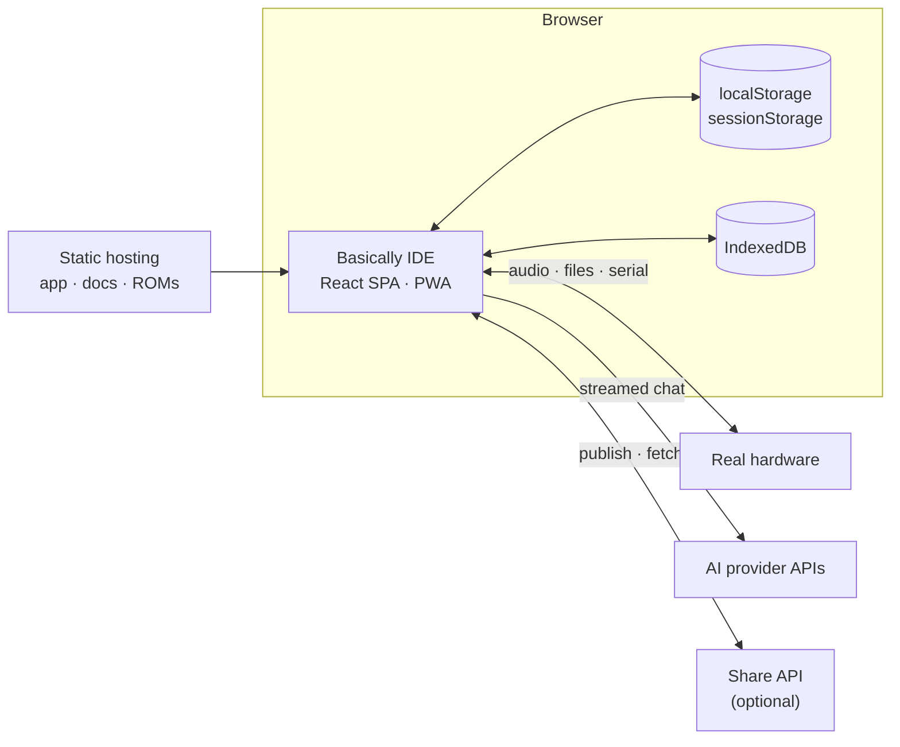
```mermaid
flowchart LR
  subgraph browser ["Browser"]
    ide["Basically IDE<br/>React SPA · PWA"]
    ls[("localStorage<br/>sessionStorage")]
    idb[("IndexedDB")]
    ide <--> ls
    ide <--> idb
  end

  host["Static hosting<br/>app · docs · ROMs"] --> ide
  ide <-->|"audio · files · serial"| hw["Real hardware"]
  ide -->|"streamed chat"| ai["AI provider APIs"]
  ide <-->|"publish · fetch"| share["Share API<br/>(optional)"]
```

Four things cross the network. Three are optional.

| Traffic               | Detail                                                                                                                                                                                        |
| --------------------- | --------------------------------------------------------------------------------------------------------------------------------------------------------------------------------------------- |
| **Static assets**     | App, docs and the ROMs under `public/roms/`, same origin. The service worker precaches the app and docs; ROMs are cached on first use.                                                        |
| **AI chat**           | Streamed HTTPS calls straight to the configured provider, using the user's own key. The key is stored locally and sent nowhere else. See `src/ai/providers/` for the provider set.            |
| **Share links**       | The one first-party service. Publishing POSTs a program to the share API and gets a six-character id. `VITE_SHARE_API_URL` is read at build time; without it the UI reports "not configured". |
| **Hardware transfer** | Cassette audio through speakers and microphone, downloaded image files, or a WebSerial link to a microcontroller bridge.                                                                      |

## Layers

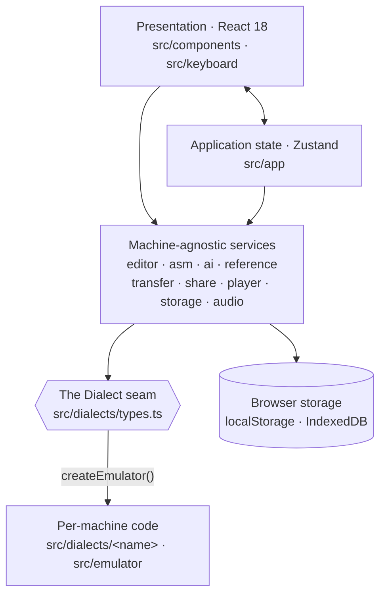
```mermaid
flowchart TB
  ui["Presentation · React 18<br/>src/components · src/keyboard"]
  store["Application state · Zustand<br/>src/app"]
  svc["Machine-agnostic services<br/>editor · asm · ai · reference<br/>transfer · share · player · storage · audio"]
  seam{{"The Dialect seam<br/>src/dialects/types.ts"}}
  mach["Per-machine code<br/>src/dialects/&lt;name&gt; · src/emulator"]
  persist[("Browser storage<br/>localStorage · IndexedDB")]

  ui <--> store
  ui --> svc
  store --> svc
  svc --> seam
  seam -->|"createEmulator()"| mach
  svc --> persist
```

| Layer                                                                                                                  | Responsibility                                                   |
| ---------------------------------------------------------------------------------------------------------------------- | ---------------------------------------------------------------- |
| **Presentation**<br>`src/components/` · `src/keyboard/`                                                                | React UI shell, dialogs, virtual input                           |
| **Application state**<br>`src/app/`                                                                                    | Single store, request counters, run loop helpers, profiler       |
| **Language toolchain**<br>`src/dialects/`                                                                              | The `Dialect` seam, registry and one folder per machine          |
| **Emulation**<br>`src/dialects/<name>/emulator/` · `src/emulator/`                                                     | Machines, vendored CPU cores, shared chips                       |
| **Assembler**<br>`src/asm/`                                                                                            | Paired assembler/disassembler engines per CPU                    |
| **Editor services**<br>`src/editor/`                                                                                   | CodeMirror language, completion, lint and analysis builders      |
| **Reference data**<br>`src/reference/`                                                                                 | Structured machine reference shared by the docs and the AI       |
| **Integration services**<br>`src/ai/` · `src/transfer/` · `src/share/` · `src/player/` · `src/audio/` · `src/storage/` | AI, hardware transfer, sharing, sound, persistence               |
| **Operation layer**<br>`src/ops/`                                                                                      | One declaration per operation; every caller derives from it      |
| **Headless toolchain**<br>`src/cli/` · `src/dialects/headless/` · `scripts/basically`                                  | The same toolchain outside the browser                           |
| **The host**<br>`src/server/` · `scripts/basically-server`                                                             | The toolchain kept running, serving every caller over one socket |
| **The client**<br>`src/client/` · `scripts/headless/cli.mts`                                                           | Finds a host or starts one, does the file I/O, renders           |
| **Language server**<br>`src/lsp/` · `scripts/headless/lsp.mts`                                                         | The editor's own language help, served to any other editor       |
| **Agent server**<br>`src/mcp/` · `scripts/headless/mcp.mts`                                                            | The whole toolchain served to an agent, over a held machine      |

### Presentation layer


| Component                                                    | Role                                                                                                                                 |
| ------------------------------------------------------------ | ------------------------------------------------------------------------------------------------------------------------------------ |
| `Workspace`                                                  | Owns the editor/monitor split; tabs on phones, with a dedicated landscape layout                                                     |
| `Toolbar`, `StatusBar`, `MobileTabBar`                       | Menus, target-machine control, run controls, byte-budget ticker                                                                      |
| `EditorTabBar`                                               | Switches between the BASIC source, each block, each scratch buffer, and files a program saved                                        |
| `CodeMirrorHost`, `AsmEditor`, `ByteEditor`                  | The BASIC editor, a code block's assembly editor, and a memory block's byte editor                                                   |
| `EmulatorPane`                                               | Hosts the canvas, drives the run loop, owns the machine instance                                                                     |
| `AiPanel`, `MemoryMapPanel`, `VariableWatcher`, `DocsDrawer` | Take over the monitor slot when opened. `DocsDrawer` embeds `/docs/` in an iframe and talks to it over `postMessage`                 |
| Dialogs                                                      | New project and machine picker, transfer, import, settings, share link, outline, run profile, block settings, target switch, welcome |

`NewProjectDialog` is the single place a program starts: machine, project name
and starting point (blank, a bundled sample, or a description for the AI).
Nothing loads implicitly. A first launch and an empty-editor target switch both
leave the editor empty.

The virtual keyboard and game controller (`src/keyboard/`) are pure
data-driven renderers. Each dialect supplies a `KeyboardLayout` (layers,
legends, glyphs, matrix tokens); the keyboard code holds no per-machine logic.

The same layouts carry a machine-independent vocabulary of key names.
`src/keyboard/keyNames.ts` resolves a written name - a letter, `SPACE`,
`ENTER`, `SHIFT`, a cursor key, a function key - to the matrix tokens that
machine presses for it, reading only what the layout _declares_: the editor
action on a legend, the modifier role on a key. It never strips a prefix off a
key id and never matches a legend glyph, because both press the wrong key
silently on a machine whose key positions and key meanings disagree.
`keyVocabulary` lists what a given machine answers to, and a name it has no key
for is refused rather than mapped onto a neighbour.
`src/keyboard/keyNames.test.ts` holds every registered machine to that on layout
data alone; the every-machine crosscheck in
`src/ai/machineObservability.test.ts` boots each one on its real ROM and presses
every name it offers.

### Application state layer

One store, `useIdeStore` (`src/app/store.ts`), holds three kinds of state:

| Group               | Contents                                                                                                                                          | Lifetime                                                                              |
| ------------------- | ------------------------------------------------------------------------------------------------------------------------------------------------- | ------------------------------------------------------------------------------------- |
| **Document model**  | Source, file name, dirty flag, memory blocks, listing-block overrides, scratch buffers, preserved tape files, auto-start line, verbatim boot disc | Autosaved and saved together; reset as a unit when a different program becomes active |
| **Session state**   | Active dialect, emulator status, live memory figures, breakpoints, paused line, block assembly errors, run profile                                | Per run                                                                               |
| **Settings and UI** | Panel and dialog visibility, split ratio, every persisted preference                                                                              | Persisted on change                                                                   |

Components subscribe through narrow selectors (`useIdeStore((s) => s.source)`).
A second store, `useAiStore` (`src/ai/aiStore.ts`), holds the chat thread.

Cross-module commands use a **request counter**, never a shared handle. The
toolbar bumps `runRequest`; a `useEffect` in `EmulatorPane` keyed on the
counter reacts. `stopRequest`, `pauseRequest`, `resetRequest`, `stepRequest`,
`continueRequest`, `romChangeRequest`, `docOverride` and `aiResetSeq` follow
the same shape. Modules stay decoupled and the state stays serialisable.

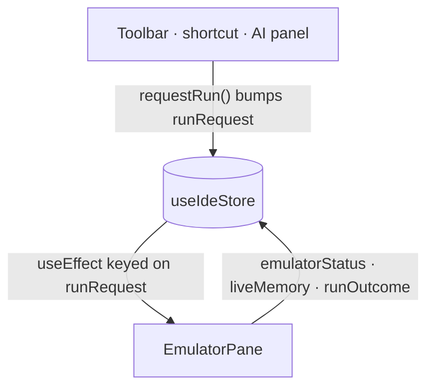
```mermaid
flowchart TB
  src["Toolbar · shortcut · AI panel"] -->|"requestRun() bumps runRequest"| store[("useIdeStore")]
  store -->|"useEffect keyed on runRequest"| ep["EmulatorPane"]
  ep -->|"emulatorStatus · liveMemory · runOutcome"| store
```

### Language toolchain: the `Dialect` seam

`src/dialects/registry.ts` is the source of truth for which machines ship.
`getDialect(id)` throws on an unknown id; `findDialect(id)` returns
`undefined`. Each dialect folder implements one interface:

| Group, and what it is for                                                                               | Members                                                                                                                                                                       |
| ------------------------------------------------------------------------------------------------------- | ----------------------------------------------------------------------------------------------------------------------------------------------------------------------------- |
| **Identity**<br>The machine picker, sorting and search, the docs page it shares                         | `id`, `name`, `manufacturer`, `year`, `basicDialect`, `basicFamily`, `blurb`, `docsReference`                                                                                 |
| **Text ⇄ bytes**<br>Editor text to a loadable image and back; errors as `TokenizeError[]`, never thrown | `tokenize`, `detokenize`, `detokenizeWithReport`, `lint`, `charset`, `crunched`, `statementSeparator`                                                                         |
| **Editor feed**<br>Highlighting, completion, line handling                                              | `keywords`, `operators`, `languageSupport()`, `completionSource`, `unnumberedLineKey`                                                                                         |
| **Hardware I/O**<br>Native image export and import, cassette encode/decode                              | `buildTargets`, `binaryImports`, `audio`, `fileExtensions`                                                                                                                    |
| **Memory**<br>What the memory-map viewer draws; where blocks may live; the RAM budget                   | `memoryMap`, `memoryBlocks`, `addressNotation`, `memoryWrites`, `memoryReads`, `programRamBytes`                                                                              |
| **Machine**<br>The emulator and what the UI feature-detects on                                          | `createEmulator()`, `romUrl`, `romBytes`, `displaySize`, `displayControls`, `keyboardLayout`, `joystickModes`, `joystickFireButtons`, `capturesDataFiles`, `unwrapStoredFile` |
| **Assistant**<br>The machine-specific prompt; bundled programs                                          | `aiProfile`, `samples`                                                                                                                                                        |

Capability flags are optional on the type and the UI feature-detects on them:
`romUrl` is absent for a machine that needs no ROM, `debuggable` gates the
debugger, `supportsBinaryLines` gates `#BIN` records.

A listing can also declare which machine it's for, on a `#MACHINE <name>` line

- the same shape as `#BIN`, but universal rather than gated per dialect, so no
  tokenizer is taught it. `src/dialects/machineDirective.ts` recognises and
  strips the line; `src/dialects/resolveListing.ts` is the one point, above the
  seam, that reads it, resolves the named dialect against the registry, and maps
  tokenizer positions back onto what the user typed. Every path that turns a
  listing into bytes - the editor lint, the run/export/share paths, the CLI's
  `lint`/`build` - routes through `resolveTokenize`/`resolveLint` there rather
  than calling `dialect.tokenize`/`dialect.lint` directly, so a path that forgot
  would be the one place a declaring program behaved differently from the rest.

::: tip One address, one definition
A dialect declares each hardware address once, in its `sysvars.ts` or
`addresses.ts`. The memory map, block linter, file formats and emulator all
import it from there. Values shared by a family live one level up (for
example `src/emulator/bbc/addresses.ts`, `src/emulator/commodore/basicPointers.ts`).
Values that merely happen to be equal stay separate.

`memoryMap.ts` stays a table of literals so it reads as a table. Tests keep it
honest: each dialect's `memoryMap.test.ts` pins its regions to the canonical
constants, and `src/dialects/memoryMap.test.ts` checks every registered map
against the program base its `memoryBlocks` reports.
:::

### Emulation layer

`Dialect.createEmulator()` returns a `MachineEmulator`. The required surface
is small; everything else is a capability the app feature-detects per machine.

| Required                                                                                        | Optional                                                                                        |
| ----------------------------------------------------------------------------------------------- | ----------------------------------------------------------------------------------------------- |
| `loadProgram(image, opts)`, `runFrame()`, `frameHz`, `renderTo(canvas)`, `reset()`, `dispose()` | `readAudio()`, `readVariables()`, `readReport()`, `readMemoryStats()`, `readScreenText()`       |
| Key and joystick input (`keyEvent`, `setKey`, `releaseAllKeys`, `setJoystick`)                  | Memory-activity tap: `setMemoryActivityRecording()` / `drainMemoryActivity()`                   |
| `isProgramRunning()` (`null` while the machine is still being handed a program)                 | Debugger: `currentLine()` / `debugStep()`. Profiler: `setProfileRecording()` / `drainProfile()` |

`loadProgram`'s options carry the rest of the document model: memory blocks
written into RAM, extra tape files mounted on the virtual tape, an auto-start
line, or a boot disc that supersedes all of them. `createEmulator` also
receives a `MachineFileStore`, the virtual filesystem a program's file I/O
lands in. `unwrapStoredFile` on the dialect says how a stored file splits into
payload and container; absent means the stored bytes are the payload.

#### Obligations every machine is held to

Optional on the type is not optional in practice. Registry-driven tests under
`src/dialects/` hold every machine to each obligation. Where a machine is
excused, the test's own table names it and the hardware reason, so an absence
is a decision somebody wrote down.

| Obligation, and the test that holds every machine to it              | Notes                                                                                                                                                                                          |
| -------------------------------------------------------------------- | ---------------------------------------------------------------------------------------------------------------------------------------------------------------------------------------------- |
| **Report whether a program is running**<br>`programRunState.test.ts` | A program that terminates must report `true` then `false` within bounded frames. Machines without a ROM cell for it latch the address where BASIC gives up (`src/emulator/programEndLatch.ts`) |
| **Screen readable as text**<br>`screenReadable.test.ts`              | No excuses table; every registered machine implements `readScreenText()`                                                                                                                       |
| **Memory-activity tap**<br>`memoryActivity.test.ts`                  | Needs a non-recording read (`peek` / `rawReadWord`) beside the CPU's read, so the IDE's own polling is not painted as program activity                                                         |
| **BASIC pointers for the RAM budget**<br>`programRamBudget.test.ts`  | `readMemoryStats()`                                                                                                                                                                            |
| **Debugger pair**<br>`debugCapability.test.ts`                       | `currentLine()` + `debugStep()`                                                                                                                                                                |
| **Per-line profile**<br>`lineProfiling.test.ts`                      | Always-on, charged in the machine's own cycles (`src/emulator/lineCostRecorder.ts`)                                                                                                            |
| **A debug slice equals a frame**<br>`debugEquivalence.test.ts`       | See below                                                                                                                                                                                      |
| **Come up without its ROM**<br>`romImage.test.ts`                    | A machine handed an empty image loads, runs and renders rather than throwing, and draws a notice saying the image is missing (`src/emulator/romNotice.ts`). See below                          |

**A missing ROM is a state, not a crash.** The images with no redistribution
grant are meant to be removable (`public/roms/ATTRIBUTION.md`), so a checkout
without one stays usable. A machine that takes its ROM through the seam is
handed an empty image, and must construct, accept a program, run frames and
render - drawing the shared no-firmware notice
(`src/emulator/romNotice.ts`) instead of its own picture, in the host's font
because the character generator is in the ROM that is missing. What it must not
do is answer about a program it never ran: `isProgramRunning()` is `null`, not
`false`. Machines that fetch their own ROM sets rather than taking `opts.rom`
catch the failure and draw their own load-error banner instead. What a machine
does with a _wrong-length_ image is its own business and deliberately not
uniform - the Sinclairs refuse one, the Apple I accepts a monitor-only image
because that is a real Apple I.

**A debug slice is a frame.** A debug session opens on an ordinary press of
Play, so `debugStep()` is how most machines are usually run. Everything
`runFrame()` does around CPU work (profiler charge, cycle counter, frame
counter, sound flush) must happen in a slice too. A machine therefore does not
write two loops: `src/emulator/machineLoop.ts` owns the walk over the frame's
cycle budget, breakpoint arming and line watch, and `createMachineLoop(contract)`
returns the `runFrame`/`debugStep` pair. The machine supplies only its `step()`
and the per-slice hooks. A machine with no `currentLine()` may keep its own
loop, with the reason written at its `runFrame`.

#### Where machine code lives

| Pattern, and where it lives                                                       | Example                                                                |
| --------------------------------------------------------------------------------- | ---------------------------------------------------------------------- |
| **Self-contained machine over a vendored CPU**<br>`src/dialects/<name>/emulator/` | The Sinclair machines over `src/emulator/z80/`                         |
| **In-tree machine with its own chipset**<br>`src/emulator/<name>/`                | `src/emulator/cpc/` (gate array, CRTC, PPI)                            |
| **Adapter around a third-party core**<br>`src/emulator/<name>/`                   | `src/emulator/bbc/` around jsbeeb; `src/emulator/c64/` around viciious |
| **Interpreter, no CPU or ROM**<br>`src/dialects/<name>/interpreter/`              | The TRS-80 Level II and Dartmouth backends                             |
| **Shared chips and helpers**<br>`src/emulator/<chip>/`, `src/emulator/*.ts`       | `ay/` (AY-3-8912), `i8080/`, `commodore/`, `microsoftBasicVars.ts`     |

Vendored cores (`src/emulator/z80/`, `src/emulator/6502/cpu6502.js`,
`src/emulator/c64/viciious/`, the jsbeeb package) are third-party and never
hand-edited. See [Don't touch](/contributing/contributing#don-t-touch).

#### Vendored core caveats

What each core does not model, and what the adapter makes up for. A machine
built on one of these inherits its limits, which is the effort estimate behind
[the roadmap](/contributing/dialect-roadmap#bundled-cores).

| Core                      | What it does not model, and what the adapter does about it                                                                                                                                                                                                                                                                       |
| ------------------------- | -------------------------------------------------------------------------------------------------------------------------------------------------------------------------------------------------------------------------------------------------------------------------------------------------------------------------------- |
| **Z80**                   | Reports total T-states per instruction, not when each bus access happened, and has no floating bus. The Spectrums charge ULA contention against a believed CPU position, re-synced at each instruction boundary (`src/dialects/zxspectrum/emulator/ulaContention.ts`). A raster sync reading port `0xFF` will not work.          |
| **Z80 as 8080**           | The 8080 fills P with parity where the Z80 uses overflow, and applies `DAA` as for an addition. `src/emulator/i8080/` restores both, and any 8080 machine uses it rather than repeating the tables.                                                                                                                              |
| **viciious**              | Public-domain subset of upstream `69f0dc6`, PAL only, no sprite DMA, ~40 upstream `TODO`s. It fetches the character matrix on a bad line but never pulls BA, so `src/emulator/c64/badLines.ts` models the arbitration and `c64Machine.ts` withholds the CPU tick on the cycles the chip owns. Its `index.d.ts` is repo-authored. |
| **jsbeeb**                | Its model table carries only the models it ships, so machines it lacks are blocked upstream rather than merely expensive. Nothing to make up for.                                                                                                                                                                                |
| **Auto-`RUN` after load** | OS keyboard-buffer addresses differ between OS versions, and power-on timing differs between models. Machines type `RUN` through the key matrix instead, which is OS-version independent.                                                                                                                                        |

### Assembler layer

`src/asm/` holds one paired assembler/disassembler engine per CPU behind an
`AsmEngine` interface, looked up with `asmEngineFor(cpu)`. A single instruction
table drives both directions, so bytes disassemble to text that reassembles to
identical bytes. `disassemble()` tiles every byte; `disassembleReachable()`
follows control flow from the entry point and emits unreachable bytes as `DB`.
Diagnostics are `AsmError[]`, the same shape as `TokenizeError`.

### Editor services

`src/editor/` holds generic CodeMirror 6 builders parameterised by the
`Dialect`:

- A `StreamLanguage` highlighter from the keyword table; keyword, variable and
  construct completion sources.
- `dialectLinter`, which wraps `dialect.lint()` into CodeMirror diagnostics.
- Line numbering and renumbering, the program outline, and POKE-address
  detection that feeds the memory-map markers.
- Variable analysis: identity under the machine's significance rules, usage
  highlighting and undeclared-variable lint.
- Case normalisation as you type, and inline chips for `#BIN` records and
  control codes.
- A `CrunchMatcher` facet for dialects whose ROM ignores spaces and matches the
  longest keyword at every position (`POKEA,10` is `POKE A,10`).

The builders know no machine. The one exception is the construct-template table
in `constructs.ts`, keyed by dialect id.

### Shared reference data

`src/reference/` holds the machine reference in structured form: one table per
reference page listing every command, function and operator; language-rule and
hardware facts; per-capability porting advice; escape-code tables; and
`compare.ts`, the diff logic behind the porting comparison. Crosscheck tests
pin all of it to the real dialects.

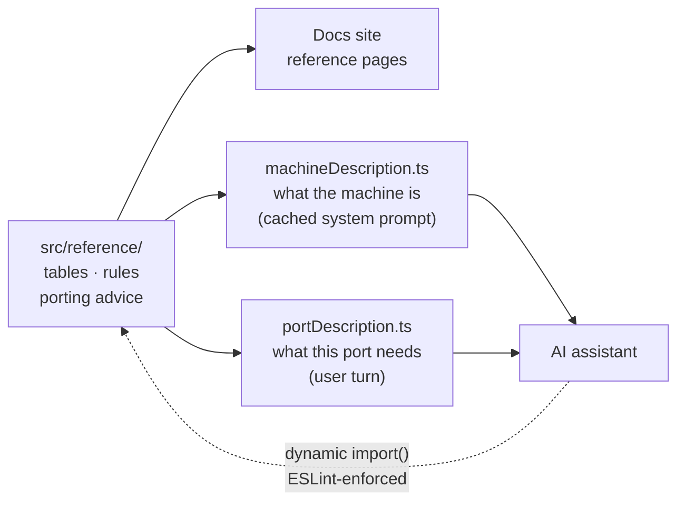
```mermaid
flowchart LR
  ref["src/reference/<br/>tables · rules<br/>porting advice"]
  docs["Docs site<br/>reference pages"]
  md["machineDescription.ts<br/>what the machine is<br/>(cached system prompt)"]
  pd["portDescription.ts<br/>what this port needs<br/>(user turn)"]
  ai["AI assistant"]
  ref --> docs
  ref --> md --> ai
  ref --> pd --> ai
  ai -.->|"dynamic import()<br/>ESLint-enforced"| ref
```

Two consumers, by design. The docs render it; the AI assistant composes it into
every request. The same data serves both, so what the assistant is told and
what the user is shown cannot disagree. `describePort` mirrors the comparison
page's calls one for one.

Two boundaries hold this in place:

- **Nothing here reaches the dialect registry.** The docs runtime cannot
  afford it (every dialect index pulls in an emulator core). `machines.ts`
  restates what the registry knows; `machines-crosscheck.test.ts` keeps it
  honest.
- **The app reaches it only through a dynamic `import()`** in
  `src/ai/machineReference.ts`. The tree is tens of thousands of lines the
  assistant alone needs, so it is code-split per page. An ESLint
  `no-restricted-imports` rule refuses static imports of `src/reference/**`.

`loadMachineReference` throws for an unregistered page, because a test sweeps
every dialect. `loadReferencePage` / `loadEscapePage` return `undefined`,
because their caller is a click that must still do what it can.

### Integration services

| Service                                              | Contents                                                                                                                                                                                                                                                          |
| ---------------------------------------------------- | ----------------------------------------------------------------------------------------------------------------------------------------------------------------------------------------------------------------------------------------------------------------- |
| **AI**<br>`src/ai/`                                  | Provider registry with lazy-loaded SDK backends; `aiClient.ts` exposes one `streamChat()`; prompt builder; code extractor and merger                                                                                                                              |
| **Transfer**<br>`src/transfer/`                      | WAV packing, speaker playback and microphone capture, the CRC-checked WebSerial bridge ([protocol](/reference/serial-protocol)). Cassette codecs and image formats stay per-dialect                                                                               |
| **Share and player**<br>`src/share/` · `src/player/` | `shareClient.ts` publishes and fetches; `compatibility.ts` decides which other dialects can open a program; `routes.ts` maps `/<verb>/<id>` to a machine and stays dependency-free so the share backend can bundle it; `PlayerApp.tsx` is the emulator-only shell |
| **Emulator audio**<br>`src/audio/`                   | A Web Audio `AudioWorklet` ring buffer the run loop pumps `readAudio()` into                                                                                                                                                                                      |
| **Storage**<br>`src/storage/`                        | Typed accessors under the `mbide.*` namespace, the `.zip` project bundle, File System Access helpers with a download fallback, custom ROM images, the virtual filesystem                                                                                          |

`src/storage/safeStorage.ts` installs an in-memory stand-in when the browser
blocks site data, so the app still starts. Autosave writes a per-tab
`sessionStorage` slot with a `localStorage` backup. Custom ROMs are the one
store that reports write failure instead of swallowing it: an upload that
silently did not stick is indistinguishable from a broken feature.

### The emulator virtual filesystem

`src/storage/vfs/` is where a running program's file I/O lands when a machine
traps it. The authoritative store is a synchronous in-memory map, because ROM
traps fire between instructions and cannot await. Every mutation is mirrored
into IndexedDB through RxDB (loaded dynamically on first use), and read back
when a machine starts, so a file outlives the session that wrote it.

- **Lifetime.** Files are kept per machine and per browser tab. Starting,
  stopping, pausing and resetting keep them. Only the document-lifecycle
  actions in the store discard them: a target switch, the player boot, and
  every path that replaces the open document.
- **Mounted content** (the document's blocks and imported tape files) is
  flagged `mounted` and never persisted.
- **Projection, not mirror.** `src/app/dataBlocks.ts` projects the store's
  listing to the `DataBlock` tabs the editor shows, subscribed through
  `useSyncExternalStore` with a throttled wake. There is one copy of the bytes.
  A `DataBlock` has no address and is not part of the document, so it is a
  separate type from `Block`.

### Third-party libraries

| Library                                        | Role                                                                 |
| ---------------------------------------------- | -------------------------------------------------------------------- |
| React 18 + Zustand 5                           | UI and state                                                         |
| CodeMirror 6                                   | Editor: language, autocomplete, lint, search                         |
| `@anthropic-ai/sdk`, `openai`, `@google/genai` | AI provider backends (lazy-loaded)                                   |
| jsbeeb                                         | BBC core, and the 6502, video and sound chips other machines reuse   |
| Vendored Z80, 6502 and viciious cores          | Under `src/emulator/` (see licences and attribution)                 |
| fflate                                         | Zip codec for the project bundle                                     |
| RxDB + RxJS                                    | Reactive IndexedDB store behind the virtual filesystem (lazy-loaded) |
| Vite 6 + `vite-plugin-pwa`                     | Build, dev server, service worker                                    |
| VitePress (+ mermaid, lazy-loaded)             | This documentation site                                              |
| Vitest 4 + Playwright                          | Unit and end-to-end tests                                            |

## Data flow

### Running a program

Pressing **Play** bumps `runRequest`. `EmulatorPane` reacts, builds the machine
if needed, tokenizes the source into a full memory image, and flash-loads it
the way the ROM would load from tape. The build step is dialect-specific; the
shape is the same for every machine.

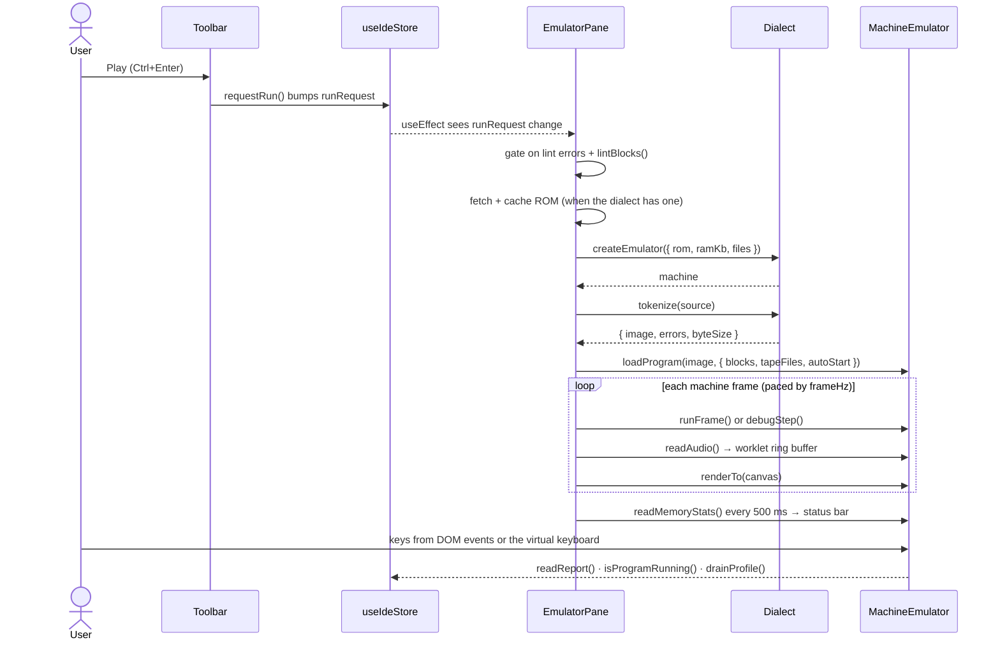
```mermaid
sequenceDiagram
  actor U as User
  participant T as Toolbar
  participant S as useIdeStore
  participant E as EmulatorPane
  participant D as Dialect
  participant M as MachineEmulator

  U->>T: Play (Ctrl+Enter)
  T->>S: requestRun() bumps runRequest
  S-->>E: useEffect sees runRequest change
  E->>E: gate on lint errors + lintBlocks()
  E->>E: fetch + cache ROM (when the dialect has one)
  E->>D: createEmulator({ rom, ramKb, files })
  D-->>E: machine
  E->>D: tokenize(source)
  D-->>E: { image, errors, byteSize }
  E->>M: loadProgram(image, { blocks, tapeFiles, autoStart })
  loop each machine frame (paced by frameHz)
    E->>M: runFrame() or debugStep()
    E->>M: readAudio() → worklet ring buffer
    E->>M: renderTo(canvas)
  end
  E->>M: readMemoryStats() every 500 ms → status bar
  U->>M: keys from DOM events or the virtual keyboard
  M-->>S: readReport() · isProgramRunning() · drainProfile()
```

1. **Edit.** CodeMirror owns the text; the store mirrors it as `source`.
   Replacing the buffer's contents (open, AI apply, target switch) goes through
   `docOverride` as an ordinary transaction, so it stays undoable. Showing a
   different buffer swaps a parked `EditorState` (`src/editor/bufferHistory.ts`)
   with `view.setState`, which no history sees.
2. **Gate.** The run is refused on editor lint errors (when the setting is on)
   and on any error-severity block problem: out of range, overlapping, or
   colliding with the program.
3. **Build the machine.** On first run for a dialect, fetch and cache the ROM
   (a user-installed ROM takes precedence), then `createEmulator()`.
4. **Tokenize.** `resolveTokenize(dialect, source)` - `dialect.tokenize` with a
   `#MACHINE` declaration honoured - yields the bytes, the loadable image, the
   byte size for the RAM budget, and any errors.
5. **Load and run.** `loadProgram` writes blocks into RAM, mounts tape files
   and starts the program. A `requestAnimationFrame` loop paints each animation
   frame; `src/app/frameClock.ts` converts elapsed time into whole machine
   frames at `frameHz`, so emulated speed is not a property of the display's
   refresh rate. On a debuggable machine the loop calls `debugStep()` on every
   run, since a session opens on Play and simply never pauses unless a
   breakpoint is set. A document with a boot disc skips all of this and boots
   the disc verbatim.

### Editing and linting

Two debounced consumers run the tokenizer as a dry run while the user types.
No machine is involved.

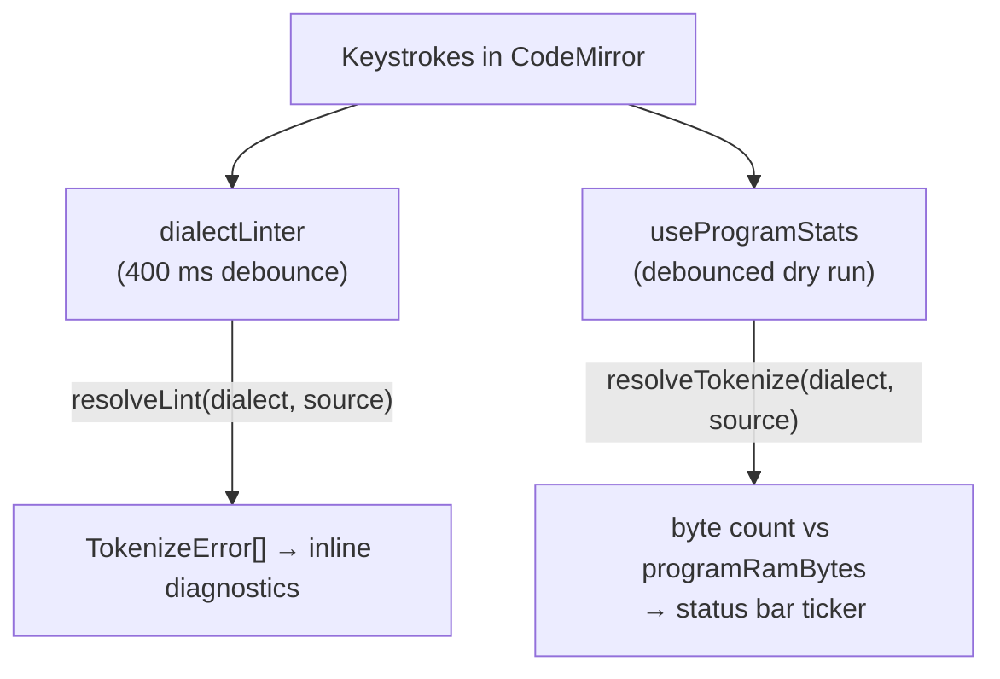
```mermaid
flowchart TB
  typing["Keystrokes in CodeMirror"] --> lint["dialectLinter<br/>(400 ms debounce)"]
  typing --> stats["useProgramStats<br/>(debounced dry run)"]
  lint -->|"resolveLint(dialect, source)"| diags["TokenizeError[] → inline diagnostics"]
  stats -->|"resolveTokenize(dialect, source)"| budget["byte count vs programRamBytes<br/>→ status bar ticker"]
```

Once a machine runs, the status-bar figure switches to
`machine.readMemoryStats()`, the machine's own BASIC pointers, and falls back to
the estimate when the machine cannot report them.

### Memory blocks and assembly

A document is BASIC source plus zero or more **blocks**: bytes destined for a
fixed address. A `code` block is edited as assembly; a `memory` block as bytes.
`Block` is the union of the two. Blocks get their own editor tabs and travel
with the document through autosave, the project bundle, cassette export and
share links. Older documents spell a memory block `'data'`; the shared bundle
parser maps it to `'memory'`.

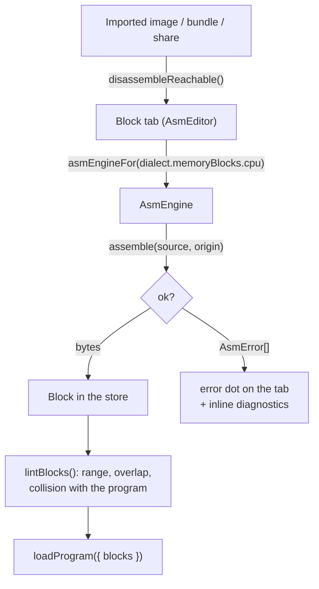
```mermaid
flowchart TB
  tab["Block tab (AsmEditor)"] -->|"asmEngineFor(dialect.memoryBlocks.cpu)"| eng["AsmEngine"]
  eng -->|"assemble(source, origin)"| ok{"ok?"}
  ok -->|"bytes"| blk["Block in the store"]
  ok -->|"AsmError[]"| dot["error dot on the tab<br/>+ inline diagnostics"]
  imp["Imported image / bundle / share"] -->|"disassembleReachable()"| tab
  blk --> lintb["lintBlocks(): range, overlap,<br/>collision with the program"]
  lintb --> run["loadProgram({ blocks })"]
```

For dialects with `supportsBinaryLines`, blocks are derived rather than stored:
they are the `#BIN` records in the listing, and the store keeps only the
name, kind and comment overrides the record cannot carry
(`src/app/listingBlocks.ts`).

### AI assistance

The AI path runs beside the run path and meets it twice: lint errors flow into
the prompt, and runtime errors flow back into the chat. An answer that carries
code is **run as soon as it arrives**, on the visible machine, without touching
the editor. By the time the apply buttons exist, the checking is over.

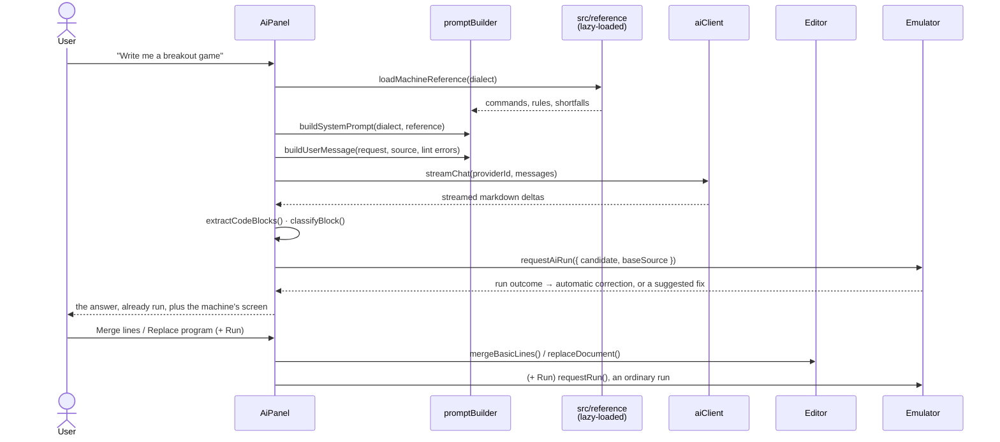
```mermaid
sequenceDiagram
  actor U as User
  participant P as AiPanel
  participant B as promptBuilder
  participant R as src/reference<br/>(lazy-loaded)
  participant C as aiClient
  participant E as Editor
  participant M as Emulator

  U->>P: "Write me a breakout game"
  P->>R: loadMachineReference(dialect)
  R-->>B: commands, rules, shortfalls
  P->>B: buildSystemPrompt(dialect, reference)
  P->>B: buildUserMessage(request, source, lint errors)
  P->>C: streamChat(providerId, messages)
  C-->>P: streamed markdown deltas
  P->>P: extractCodeBlocks() · classifyBlock()
  P->>M: requestAiRun({ candidate, baseSource })
  M-->>P: run outcome → automatic correction, or a suggested fix
  P-->>U: the answer, already run, plus the machine's screen
  U->>P: Merge lines / Replace program (+ Run)
  P->>E: mergeBasicLines() / replaceDocument()
  P->>M: (+ Run) requestRun(), an ordinary run
```

**Prompt composition**

- System prompt: the machine's composed reference, then the dialect's
  `aiProfile.systemPrompt`, then the shared `RETURNING_CODE_RULES`. Byte-stable
  per dialect, so provider-side prompt caching works.
- `aiProfile` prose carries only what no table holds: speed, hardware
  registers, how escapes are written here, the reply format.
- The user message embeds the current program and up to 20 tokenizer errors.
- **Ports** take a second path through the same data. `src/ai/portReport.ts`
  reads the program's vocabulary as the source machine and composes the
  findings via `describePort()`. Findings ride in the user turn, not the system
  prompt, because they vary with the program. The source machine crosses the
  docs-iframe boundary as `fromId`; it is never inferred from the selected
  dialect.

**Applying an answer**

- Each block is a whole listing or a fragment. The model declares which by
  fence tag (` ```basic ` / ` ```basic-partial `); `classifyBlock()`
  cross-checks the line numbers. Conflict resolves to `unknown` and the panel
  asks the user.
- Only valid actions are offered: merge for a fragment, replace for a listing,
  both for `unknown`. Applying goes through the editor's undo history.
- `mergePlan()` computes what a merge changes; `mergeBasicLines()` is defined in
  terms of it, so the inline diff cannot drift from what applying does.

**Checking an answer** (`src/app/aiRunCheck.ts`, `src/ai/aiStore.ts`)

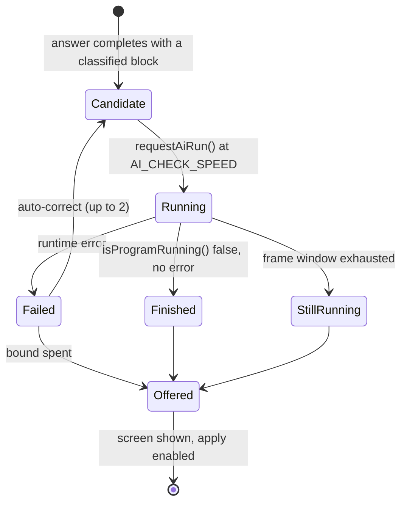
```mermaid
stateDiagram-v2
  [*] --> Candidate: answer completes with a classified block
  Candidate --> Running: requestAiRun() at AI_CHECK_SPEED
  Running --> Failed: runtime error
  Running --> Finished: isProgramRunning() false, no error
  Running --> StillRunning: frame window exhausted
  Failed --> Candidate: auto-correct (up to 2)
  Failed --> Offered: bound spent
  Finished --> Offered
  StillRunning --> Offered
  Offered --> [*]: screen shown, apply enabled
```

- A genuine runtime error (not OK, STOP or BREAK) is corrected automatically,
  up to two attempts per answer, then offered as a one-click fix.
- `EmulatorPane` prefers `aiRunSource` over `source` when
  `aiRunCheckSeq === runRequest`. Every other run is the editor's program.
- The staleness guard compares `baseSource`, not what ran: whether the user has
  moved on is a question about their program.
- A check never opens a debug session (`shouldOpenDebugSession()`), or it would
  inherit the user's breakpoints and hang.
- The screen shown to the user rides on `finalScreen`, never on
  `ChatMessage.image`: prior turns' images are replayed to keep the cached
  prefix stable, so a user-facing picture there would be re-sent every turn.
- A hidden tab gets no animation frames, so the check falls back to a timer.
- Providers report why generation stopped. An answer cut off by the output
  limit is marked incomplete and offers no apply actions.

### Profiling

Every run measures itself. There is no profiling mode. While a program runs,
the machine charges CPU cycles to the BASIC line executing
(`src/emulator/lineCostRecorder.ts`), and the run loop samples the machine's
memory pointers on a fixed cadence of emulated frames. `src/app/runProfile.ts`
turns the raw figures into shares of the run per line and per routine, and
`RunProfileDialog` shows them. Every duration is emulated time, so the speed
multiplier and the display's refresh rate never change a figure.

### Hardware transfer

Transfer is two-way and funnels through the seam: the dialect owns byte formats
and cassette codecs; `src/transfer/` owns the machine-agnostic plumbing.

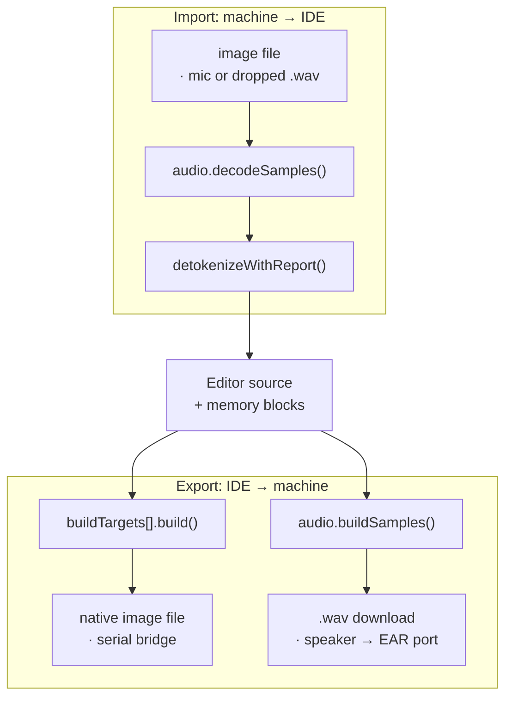
```mermaid
flowchart TB
  editor["Editor source<br/>+ memory blocks"]

  subgraph export ["Export: IDE → machine"]
    direction TB
    build["buildTargets[].build()"]
    enc["audio.buildSamples()"]
    out["native image file<br/>· serial bridge"]
    wav[".wav download<br/>· speaker → EAR port"]
    build --> out
    enc --> wav
  end

  subgraph import ["Import: machine → IDE"]
    direction TB
    src["image file<br/>· mic or dropped .wav"]
    dec["audio.decodeSamples()"]
    detok["detokenizeWithReport()"]
    src --> dec --> detok
  end

  editor --> build
  editor --> enc
  detok --> editor
```

Import is not always lossless. `detokenizeWithReport()` returns the recovered
source plus what the text form could not capture, so the Import dialog can
warn. Anything recovered beyond the listing (`CODE` blocks, extra tape files, an
auto-start line, a boot disc) lands in the document model and travels with it.

### Publishing and the player

Publishing mints a short URL that boots the program in an emulator-only shell.

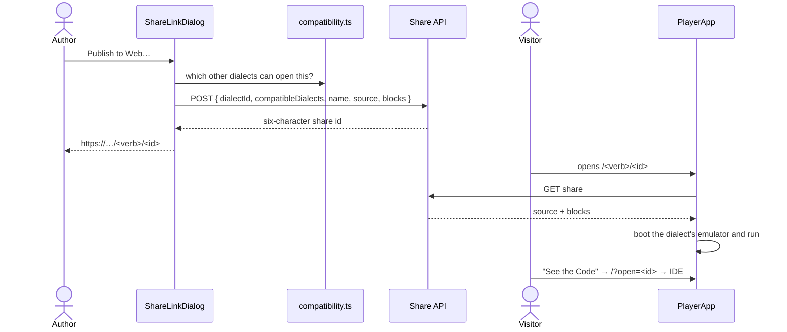
```mermaid
sequenceDiagram
  actor A as Author
  participant SD as ShareLinkDialog
  participant CC as compatibility.ts
  participant API as Share API
  actor V as Visitor
  participant PL as PlayerApp

  A->>SD: Publish to Web…
  SD->>CC: which other dialects can open this?
  SD->>API: POST { dialectId, compatibleDialects, name, source, blocks }
  API-->>SD: six-character share id
  SD-->>A: https://…/<verb>/<id>
  V->>PL: opens /<verb>/<id>
  PL->>API: GET share
  API-->>PL: source + blocks
  PL->>PL: boot the dialect's emulator and run
  V->>PL: "See the Code" → /?open=<id> → IDE
```

`parsePlayerPath()` decides at boot whether the bundle renders the IDE or the
player. Every verb is a real keyword from that machine's own BASIC, the verb
table stays in bijection with the registry, and anything that is not a known
verb plus a valid id falls through to the IDE.

### Persistence

| Store, and when it is written                                                             | Holds                                                                                                                               |
| ----------------------------------------------------------------------------------------- | ----------------------------------------------------------------------------------------------------------------------------------- |
| **`localStorage`** (`mbide.*`)<br>On change; ROMs on install                              | Settings; AI provider and per-provider API keys; custom ROM images; autosave backup                                                 |
| **`sessionStorage`** (per tab)<br>Every 2 s while changed; conversation throttled to 1 s  | Autosave slot: source, name, blocks, listing-block overrides, scratch buffers, tape files, auto-start, boot disc; AI conversation   |
| **IndexedDB** (RxDB)<br>Fire-and-forget on every file mutation                            | The virtual filesystem mirror, scoped by machine and tab                                                                            |
| **`.zip` project bundle**<br>On Save, through File System Access with a download fallback | `program.bas`, `blocks/<name>.bin`, `blocks/<name>.asm`, scratch buffers, `project.json` for the dialect id and fields with no file |

Autosave holds only real work: an untitled empty editor, or an untitled
unmodified sample, is cleared rather than restored. Naming a project makes it
real straight away. The autosave path reuses the bundle's wire codecs, so both
agree on one shape. Opening accepts the bundle, the older `.bproj`, or plain
`.bas`/`.txt` source.

## The toolchain outside the browser

`scripts/basically` runs the same toolchain under Node: describe a machine,
lint a listing, build it into the file the machine loads, or run it and report
the screen, the measurements of the run, and what its variables hold. Only
`run` needs a ROM. `scripts/basically.cmd` is the same entry point for cmd.exe
and PowerShell, and has to stay in step with it.

It is two programs. `scripts/basically-server` is a host that keeps running and
holds what is expensive to prepare - the toolchain, the ROMs, and a machine;
`scripts/basically` is a client that parses what the user asked for, reads and
writes the files involved, and asks the host to do the work. A command that
finds no host starts one, so nobody has to know whether one is running. Both
have a `.cmd` twin, and both are built by one `scripts/headless/build.mjs` run
that also writes the build id keying the address they meet at - so a client
never reaches a host built from different source.

Because the host outlives a command, **the command line holds a machine between
commands**: `run --hold` leaves the machine it booted running, and `drive`,
`look`, `screenshot`, `profile`, `time`, `variables` and `expect` act on it
until it is released. The options on `run` and `check` remain the one-shot
spelling of those same capabilities.

### One operation layer, every caller

The command line, the AI assistant and the agent server are callers of one set
of operations. Each operation is declared once in `src/ops/` - its name, a
summary, an input schema, what it needs in order to run, how each caller
reaches it, and a function from input and context to an outcome that survives
being written as JSON - and every surface is derived from the declaration: the
command line's shims call `run()` and render the outcome in their own columns,
and each caller that offers tools renders its own definitions from the name,
the description and the schema (`src/ops/tools.ts` for the assistant,
`src/mcp/tools.ts` for the server; separately, because the assistant's must be
the same bytes on every turn and the server's are under no such constraint).
The layer imports neither the filesystem, the DOM nor the store;
`eslint.config.js` refuses those imports under `src/ops/`, and what an
operation needs from either world arrives through its context (`OpContext` in
`src/ops/types.ts`): whether a ROM is present, the machine session the caller
holds, and - for a caller that can boot one - a runner and a painter.

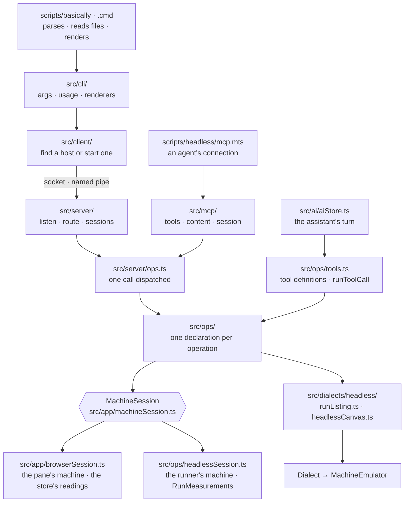
```mermaid
flowchart TB
  cli["scripts/basically · .cmd<br/>parses · reads files · renders"] --> grammar["src/cli/<br/>args · usage · renderers"]
  grammar --> client["src/client/<br/>find a host or start one"]
  client -->|"socket · named pipe"| host["src/server/<br/>listen · route · sessions"]
  host --> dispatch["src/server/ops.ts<br/>one call dispatched"]
  dispatch --> ops["src/ops/<br/>one declaration per operation"]
  ai["src/ai/aiStore.ts<br/>the assistant's turn"] --> tools["src/ops/tools.ts<br/>tool definitions · runToolCall"]
  tools --> ops
  mcp["scripts/headless/mcp.mts<br/>an agent's connection"] --> mtools["src/mcp/<br/>tools · content · session"]
  mtools --> dispatch
  ops --> session{{"MachineSession<br/>src/app/machineSession.ts"}}
  session --> browser["src/app/browserSession.ts<br/>the pane's machine · the store's readings"]
  session --> headless["src/ops/headlessSession.ts<br/>the runner's machine · RunMeasurements"]
  ops --> hl["src/dialects/headless/<br/>runListing.ts · headlessCanvas.ts"]
  hl --> seam["Dialect → MachineEmulator"]
```

**Parity is over capabilities, not over invocation.** Where a caller can hold a
machine between one request and the next, what is asked of that machine - press
these keys, look, measure - is an operation in its own right; the command line
can, now that a host outlives a command, and the options on `run` and `check`
are the same capabilities reached the one-shot way. Each declaration names its
route on each caller: an operation of its own, an option on another, a tool, or a
line of the fenced block the assistant's reply carries. The host is not itself a caller: it offers no operation of its own and declares
no absence of its own, and every operation reaches it as one of the three
callers it serves. An operation
deliberately absent from one caller is an entry in the exemption table
(`src/ops/parity.ts`) with its reason, and a reason is particular to the caller
it is claimed of: an absence that holds because of the circumstances one caller
works in is not carried over to a caller those circumstances do not describe,
so adding a caller widens what the toolchain offers rather than inheriting what
was withheld. `src/ops/parity.test.ts` is the registry-driven check that holds
every surface to the one list: it fails on an operation missing from a surface
with no entry, on an entry for an operation that is in fact reachable, on a
route the grammar, the block parsers or the served tool listing do not actually
take, on an outcome that does not survive JSON, and on an action the schedule
accepts that a caller's description omits. A provider that cannot be given
tools at all gates the assistant's whole surface and is read as a property of
the provider, never as an operation being absent.

**A machine session is one interface over a running machine.** `MachineSession`
is the driver (`src/app/machineControl.ts`: press keys, work the joystick,
advance, wait for text or for the program to end, read the screen) plus a
capture of the display, the run's measurements, its timing and its variables.
The pane registers the browser implementation while a machine is up; a
headless run builds the other over the machine the runner owns. An operation
needing a machine is written once against the session and works for either.
The assistant's tools are offered on every turn of a conversation - the block
must be the same bytes or the cached prefix behind it is lost
(`src/ops/toolStability.test.ts`) - and an operation needing a machine answers
that it was not given one when called on a turn that holds none.

**Measuring a run is a fold, wherever the run happens.** `RunMeasurements`
(`src/app/runMeasurements.ts`) folds one emulated frame into the profiler and
the stopwatch together and says whether to publish or that the program is over.
The emulator pane calls it every frame and publishes on its cadence; the
headless runner calls it through `RunOptions.observe`, which hands an observer
the machine when the program is loaded, after every frame, and once the run is
over while the machine is still up. That is what lets `run --profile`,
`--time` and `--variables` report on the same terms the IDE does.

`build` reuses the dialect's `buildTargets`, so a file written from the command
line is byte-identical to one downloaded from the Transfer dialog; its outcome
carries the bytes base64-encoded and the shim decodes them before writing.
`run` is the IDE's run path without the browser: tokenize, boot the emulator on
its ROM, load the image, read the screen back. The runner shares
`src/dialects/bootHarness.ts` with the registry-driven unit tests.

`run --keys`, `check` and the assistant's `drive` tool drive a running machine
through one driver and one script vocabulary: `src/app/driveScript.ts` reads
the grammar (`PRESS`/`JOY`/`WAIT`/`WAIT FOR`/`WAIT END`, `#` comments, actions
separated by newlines or by semicolons outside quotes) and runs it against the
session, stopping at the first step that fails. The actions are a declared
list (`DRIVE_ACTIONS`) that the command line's help and the assistant's tool
description both render from, so an action the parser accepts is described to
every caller. Key names are the shared vocabulary above. `RunOptions.drive` is
the seam on the runner's side: it hands the hook a machine and its own frame
advance and knows nothing about what a schedule is, which keeps
`src/dialects/headless/` free of `src/app/` and of the operation layer. A run
given a schedule ends where the schedule ends.

**Expectations are part of that vocabulary, not a second one.** The same
schedule carries `EXPECT` lines saying what should be on the screen, what
should not, whether the program should have stopped or still be running, what a
variable should hold, and how the screen should look. An expectation costs no
frames and asks what is true at the point in the schedule where it was written,
so "it printed this at some point" is the wait that already says so. Each step
of the report carries its action, the line it was written on and one of three
outcomes: an expectation nobody present can settle - how the screen looks, or a
reading the machine cannot give - is `unevaluated` rather than a pass or a
failure. `check` is the operation whose product is that verdict, and the
assistant's ` ```basic-expect ` block is the same schedule judged by the same
`expect` operation against the machine the IDE has up; how the screen looks is
settled only by showing the assistant the display, which is why `check` carries
an exemption against the assistant and that form is reported unevaluated
everywhere else.

### Serving an editor: the language server

`lsp` starts a server instead of doing one piece of work and finishing: it
holds its streams open and answers an editor's questions about a program until
that editor disconnects. It is reached the same way every other operation is -
`scripts/basically lsp --stdio` - and shares the split the rest of the
toolchain already uses: `src/lsp/` holds pure, `process`-free handlers, and
`scripts/headless/lsp.mts` is the shim that owns the connection.

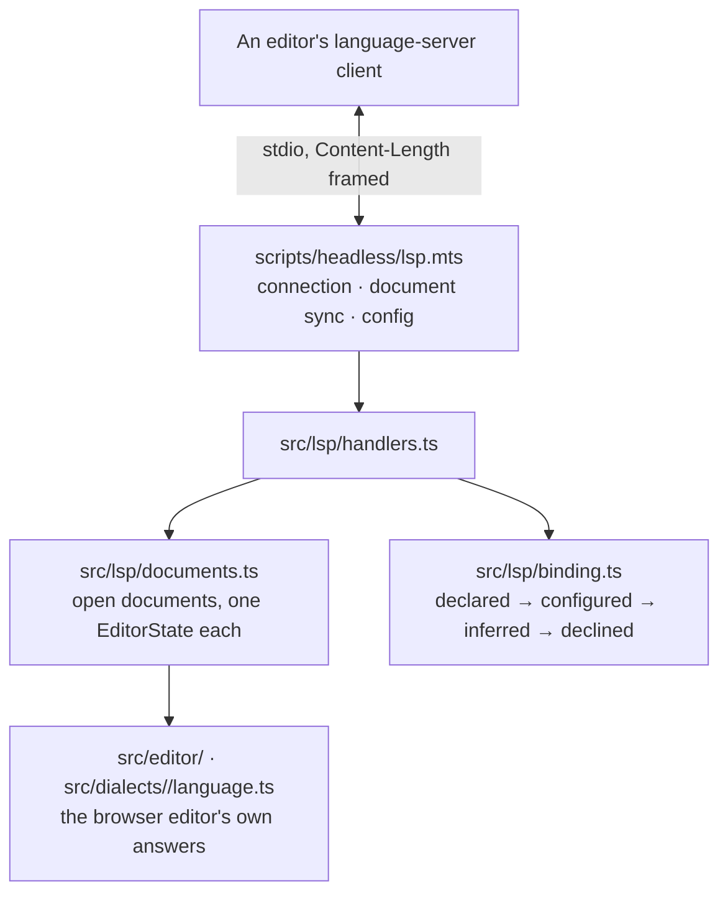
```mermaid
flowchart TB
  editor["An editor's language-server client"] <-->|"stdio, Content-Length framed"| shim["scripts/headless/lsp.mts<br/>connection · document sync · config"]
  shim --> handlers["src/lsp/handlers.ts"]
  handlers --> docs["src/lsp/documents.ts<br/>open documents, one EditorState each"]
  handlers --> binding["src/lsp/binding.ts<br/>declared → configured → inferred → declined"]
  docs --> editorSvc["src/editor/ · src/dialects/<name>/language.ts<br/>the browser editor's own answers"]
```

Every answer is the editor's own, reached headlessly: a document's
`EditorState` is built from its bound dialect's `languageSupport()` under
Node, exactly as `src/editor/completions.test.ts` already proves runs with no
DOM, and `src/lsp/completion.ts`, `hover.ts`, `definition.ts`, `symbols.ts` and
`references.ts` translate what `src/editor/` and the `Dialect` seam already
answer into the protocol's shapes - no second classifier, no second reading of
a program.

What it deliberately does not reach: no ROM is read and no machine is ever
booted, so a user with none installed gets the same help as one with every
ROM; and none of the browser-global stand-ins `src/dialects/bootHarness.ts`
installs around a running machine are ever put up, because nothing here runs
one. Standard output belongs to the protocol for the server's whole life, so
it installs the same log diversion `divertLogging()` in
`scripts/headless/cli.mts` already uses for a single run, just for longer.

### Serving an agent: the toolchain over MCP

`mcp` starts a server on the same terms `lsp` does - `scripts/basically mcp
--stdio`, streams held open until the client disconnects - and offers every
operation the toolchain declares as a tool of the Model Context Protocol. The
split is the one the rest of the toolchain uses: `src/mcp/` decides what is
offered and what an answer is, and `scripts/headless/mcp.mts` owns the
connection and the held machine's lifetime against it.

What is new here is that the machine stays up. `src/mcp/session.ts` is a
`ListingRunner` of its own rather than a change to
`src/dialects/headless/runListing.ts`: that runner disposes the machine in a
`finally`, which is exactly right for an invocation that is ending and exactly
wrong for a server. The pieces underneath are shared - `installNodeRomLoading`
and `installCanvasGlobals` from `src/dialects/bootHarness.ts`, `bootMachine`,
`resolveTokenize`, `createHeadlessSession` - so the machine an agent drives is
the machine `basically run` would have booted.

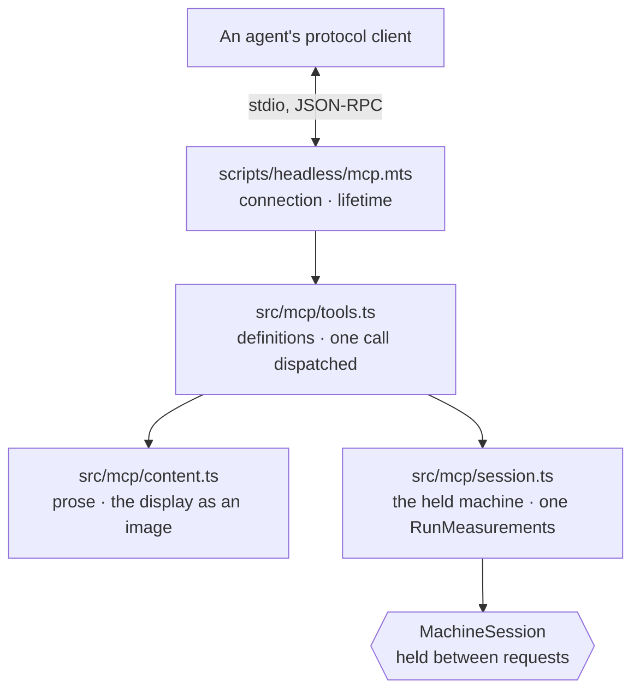
```mermaid
flowchart TB
  client["An agent's protocol client"] <-->|"stdio, JSON-RPC"| shim["scripts/headless/mcp.mts<br/>connection · lifetime"]
  shim --> surface["src/mcp/tools.ts<br/>definitions · one call dispatched"]
  surface --> content["src/mcp/content.ts<br/>prose · the display as an image"]
  surface --> machine["src/mcp/session.ts<br/>the held machine · one RunMeasurements"]
  machine --> held{{"MachineSession<br/>held between requests"}}
```

Three consequences follow, and each is a rule the tests pin:

- **The stand-ins are installed on the process, not on the machine**, so one
  machine is held at a time: running a second program lets the first go, before
  a second set is ever installed.
- **Frames are spent by requests.** Nothing advances the machine between them,
  so a read costs nothing, an action costs what it costs, and a measurement is
  in the machine's own time however long the client took to think.
- **A run is folded once.** Draining a machine's per-line costs takes them, so
  a second `RunMeasurements` over the same run would see nothing; the server
  owns the one fold and answers a run's `profile`/`time` off the machine it
  left up, which is also what a later `profile` call reads.

Standard output belongs to the protocol for the server's whole life, so it
installs the same `divertLogging()` diversion, and whatever machine is up goes
with the connection - a client that is killed strands neither a machine nor the
stand-ins under it.

## Where to go next

- [Contributing guide](/contributing/contributing): setup, conventions, PR
  workflow.
- [Adding a dialect](/contributing/adding-a-dialect): bringing up a new machine
  behind the seam.
- [File formats](/reference/file-formats) and the
  [serial bridge protocol](/reference/serial-protocol): the byte-level
  contracts the transfer layer implements.
- [Machine code](/guide/machine-code) and [Publishing](/guide/publishing): the
  user-facing side of the block and share-link flows.
