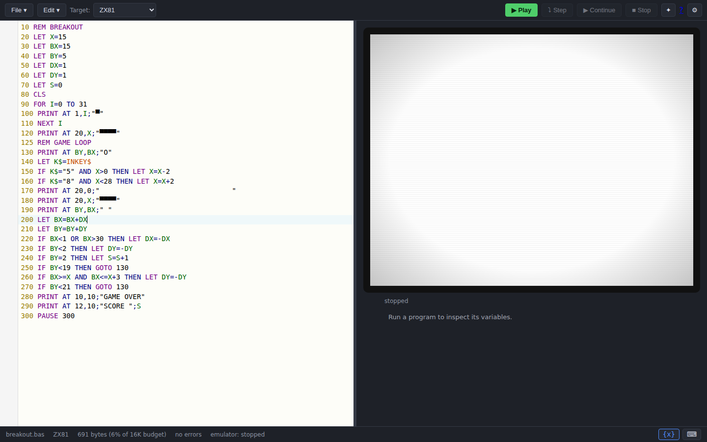
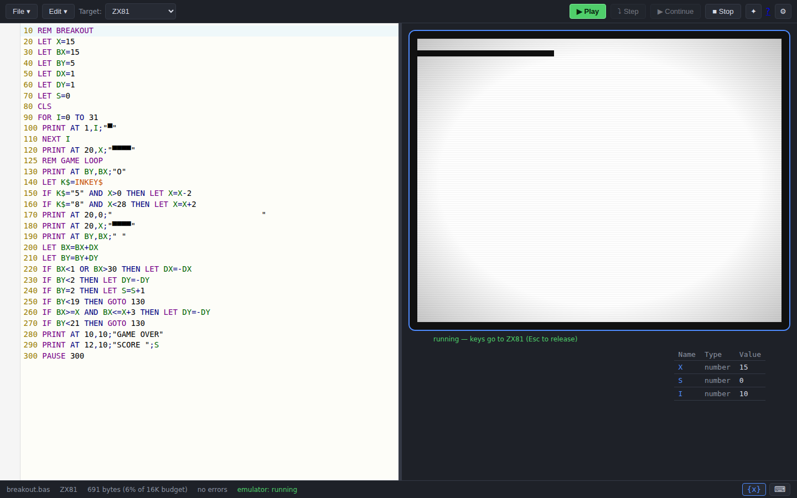
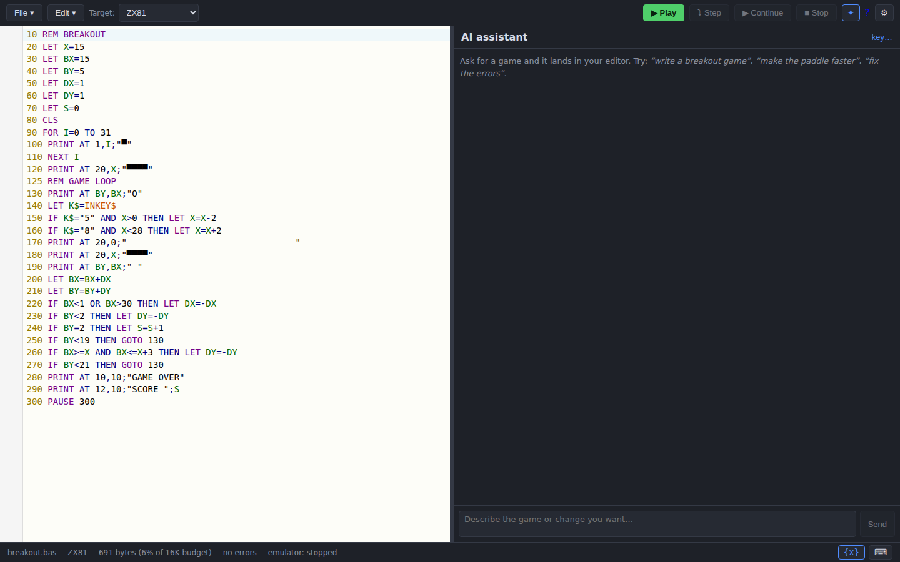
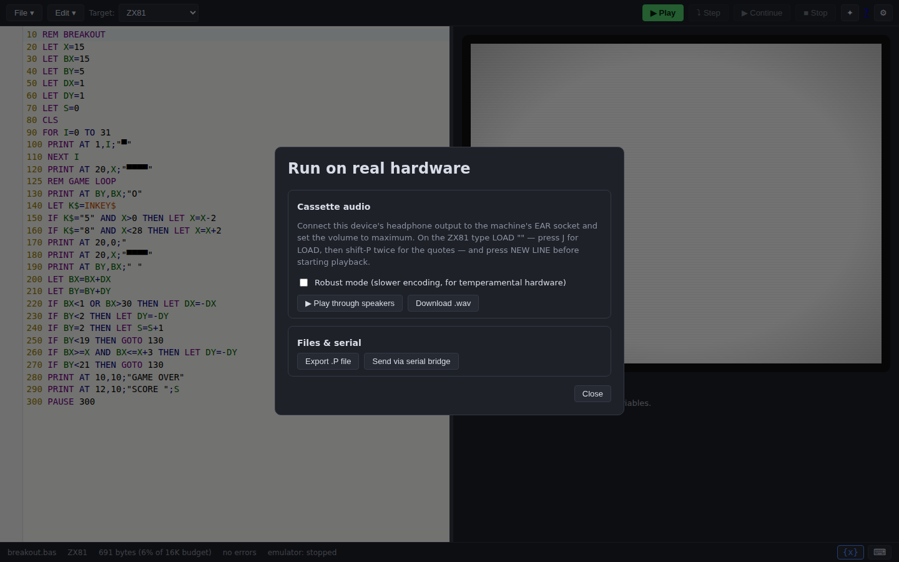

## What is Basically?

**Basically** is a browser-based IDE for writing BASIC for classic
microcomputers. You write in a modern editor — with highlighting, completion and
inline error checking — and run your program in a cycle-accurate emulator of the
real machine, booting its original ROM. When it works, you can ship it to real
hardware over cassette audio, a downloadable image file, or a serial bridge.

It ships six dialects today: the **Sinclair ZX81, ZX80 and ZX Spectrum**, the
**BBC Micro and BBC Master**, and the **Commodore 64**.

## A closer look

### Write and lint

The editor highlights your chosen dialect, autocompletes keywords (with
per-keyword documentation), and runs the tokenizer continuously so syntax errors
are underlined as you type. A byte counter shows how much of the machine's RAM
your program will use.

### Run it on the real machine

Press **▶ Run** (or `Ctrl`+`Enter`) and Basically tokenizes your source to a
machine image and loads it through the emulator the same way the real ROM would
load from tape. The display and keyboard are hardware-accurate — click the screen
and play.

### Generate code with AI

Open the **✦ AI** panel, add your Anthropic API key, and ask for a game or a
routine. Claude is given the active machine's dialect rules, so the BASIC it
writes actually runs. Apply a suggestion with one click — replace, merge by line
number, or replace and run.

### Ship to real hardware

When you're ready to leave the emulator behind, the **⇥ Hardware** dialog can
play the program out as cassette audio, save a native image file for an SD
interface, or push it over WebSerial to a microcontroller bridge.

## Get started

1. **[Open the IDE](https://ba.sical.ly/)** — nothing to install.
2. Pick **File ▸ Samples ▸ Breakout**, press **▶ Run** (or `Ctrl`+`Enter`),
   click the screen and play with the `5` and `8` keys.
3. For AI generation, click **✦ AI**, add your Anthropic API key (created at
   [platform.claude.com](https://platform.claude.com/)), and ask for a game.

New here? The **[Getting started guide](/guide/getting-started)** walks through
your first program step by step.
