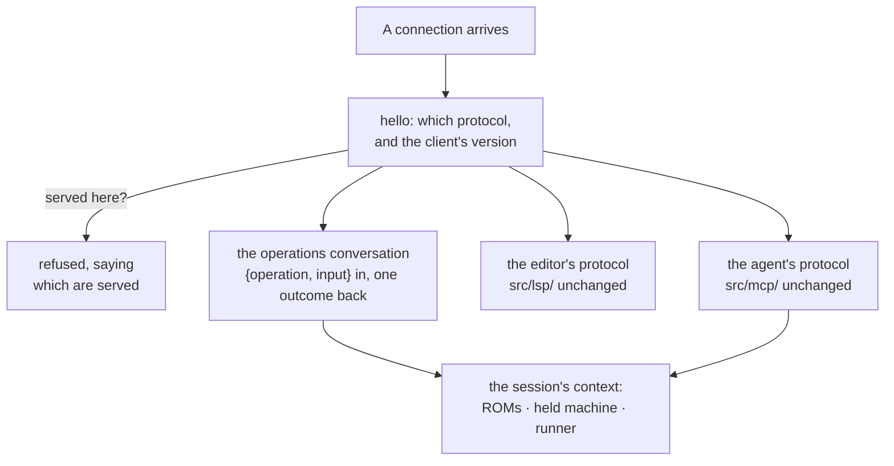

## Context

`docs/contributing/architecture.md` §"The toolchain outside the browser"
describes the shape this change alters: one operation layer under `src/ops/`,
three callers derived from it, and a command line that is a process shell around
a single invocation. Read it first — this document only says what moves.

Three facts about the code as it stands make the split much smaller than it
sounds, and the design leans on all three rather than introducing new machinery:

- **The argument grammar is already pure.** `src/cli/args.ts` reads no `process`,
  no argv and no filesystem, and its result is documented as "the operation's own
  input with the program's text left for the shim to read, beside what only the
  command line knows". A client can parse without a server, and a server never
  needs to see an argv.
- **Outcomes already survive JSON, and already carry bytes.** The `Operation`
  contract requires it and `src/ops/parity.test.ts` pins it; `buildOp`'s
  `files[].base64` and `runOp`'s `picture.png` are already base64, and the
  current shim decodes and writes them. A built file or a screenshot crosses a
  socket with nothing added.
- **The server's context already exists.** `src/mcp/context.ts` is `cliContext()`
  plus a held session and a runner that leaves its machine up. The command line's
  new front door wants exactly that object, unchanged.

The constraint that shapes everything else is stated in `src/mcp/session.ts`: the
browser stand-ins are installed **on the process, not on the machine**, so a
second set nested inside the first would be restored in the wrong order. One
process therefore holds at most one machine.

**Impact on the `Dialect` / `MachineEmulator` seam: none.** Nothing in this
change reaches below `src/ops/` and `src/dialects/headless/`. No dialect, no
emulator, no bus and no `Dialect` member is touched; the machine a command drives
through a server is the machine `basically run` boots today, on the same code
path.

## Goals / Non-Goals

**Goals:**

- A machine that stays up between commands, so the command line reaches the
  operations that act on one as operations rather than as options.
- One warm host for all three conversations, so an editor, an agent and a shell
  do not each load the toolchain separately.
- A command that works whether or not a server is already running, without the
  user having to know which.
- Identical behaviour on Windows, macOS and Linux, including the addressing.

**Non-Goals:**

- Any network transport, any remote access, any authentication beyond the socket
  the operating system already protects.
- Sharing one machine between two callers.
- Installing either program onto a user's `PATH` — see the proposal's non-goals.
- Making the client bundle independent of the emulators (see Open Questions).

## Decisions

### 1. The socket carries the framing the toolchain already speaks

A running server cannot be reached over standard streams: those exist only
between a process and the child it spawned. The server therefore listens on a
Unix domain socket (macOS, Linux) or a named pipe (Windows), which
`net.createServer()` accepts as one API with a platform-shaped path, and carries
the same `Content-Length`-framed JSON-RPC the stdio interface already speaks.

_Alternative considered:_ binding a loopback TCP port recorded in a lockfile.
Uniform across platforms with no path quirks, but any local process could connect,
so it would need a token handshake invented for the purpose. The socket gets the
same property from filesystem ownership, which is already enforced and already
audited.

_Alternative considered:_ no server at all — the client spawns a private child
each time and talks over its pipes. That is the truest reading of "the existing
stdio interface", but it delivers none of the point: no warm host, no machine
between commands, nothing to start or stop.

### 2. Protocols are routed by a handshake, not rewritten

Both protocol libraries are constructed over streams rather than over `process`
specifically — `StdioServerTransport(stdin?, stdout?)` and
`createConnection(inputStream, outputStream)` both take them — so a connection's
socket substitutes for the process's streams directly. Routing is therefore a
handshake:

Which protocols a server offers is chosen when it is started, so it may serve any
one of them or all three. Serving over standard streams remains a mode of its
own: one client, one protocol, no handshake — which is exactly what an editor or
an agent that spawns the toolchain itself does today, and why nothing they have
configured breaks.

### 3. The operations conversation is `{operation, input}` and one outcome

The command line's front door is not a new protocol so much as the one
`src/mcp/tools.ts` already implements without the protocol's clothing: a call
names an operation and carries its input, the input is validated on arrival by
`src/ops/schema.ts`'s existing `schemaProblem()` — the same check a model's tool
call goes through — and the reply is the operation's outcome as JSON.

_Alternative considered:_ shipping the parsed `CliArgs` over the wire. Rejected:
it would make the server's front door specific to one caller's grammar, when the
grammar is precisely the part that belongs to the client.

### 4. The client owns every path; the server owns no working directory

The client reads the program (from the file named or from standard input) and the
expectations file, resolves a ROM root to an absolute path before sending it, and
writes `-o` output and `--screenshot` from the base64 the outcome carries. This
is not a new rule but the existing one restated: `src/ops/` is already forbidden
by ESLint from importing the filesystem, and the current shim already does every
one of these. A server that never resolves a relative path cannot be confused by
having a different working directory from its client.

### 5. A machine-holding session runs in a worker thread

The stand-ins are process-global, so a server serving several clients cannot
naively hold several machines. Each Node worker thread has its own `globalThis`,
so putting a machine-holding session in a worker makes the stand-ins per-worker
and leaves the existing "one machine at a time" invariant true *within a worker*,
exactly as it is true within the process today — unchanged, not weakened. The
main thread stays free to route and to serve the editor's protocol, which never
boots a machine.

Cost: the bundle loads per worker, and inputs and outcomes cross a thread
boundary — which they already survive, being JSON by contract.

_Alternative considered:_ one machine server-wide, claimed by a session, with a
second claimant told who holds it. Simpler, and keeps the existing spec sentence
literally true, but it makes a shell and an agent contend for one machine on a
host whose whole purpose is to be shared. Kept as the fallback if the worker cost
proves unacceptable in practice.

### 6. The server is not a fourth caller

`src/ops/parity.ts` gains no `Caller`. The server offers no operation of its own
and declares no exemption of its own: it is a host for the three callers that
already exist, and every operation reaches it only as one of them. Adding a
`Caller` would claim a surface that has no user and would ask the parity check a
question about a thing that answers no one.

What does change is the route the command line declares. `CliRoute`'s
`{ kind: 'option' }` exists because "a command line invocation holds no machine
between runs"; once that is false, the seven session-needing operations
(`drive`, `look`, `screenshot`, `profile`, `time`, `variables`, `expect`) become
`{ kind: 'operation' }`. The `run --keys` / `--profile` / `--screen-text` and
`check --expect` options stay as the one-shot spelling of the same capability, so
nothing a user has scripted stops working. `src/ops/parity.test.ts` fails in both
directions, so this cannot be half-made.

### 7. Discovery, autostart and the race

The client resolves the address for this user and this server version, and tries
to connect. On success it hands over the handshake and proceeds. On failure it
locates a server — beside the client first, then on `PATH` — starts one detached,
and retries with a bounded backoff.

Keying the address on the version is what makes this safe: a client never reaches
a server built from different source, so a stale server is invisible rather than
wrong. Two clients racing both try to start one; the loser's bind fails and it
connects to the winner. An address that exists but refuses connection is a dead
server's leftover: unlink and retry once. On Windows a named pipe disappears with
its process, so that case does not arise there.

### 8. Exit codes and stream purity are the client's, as they always were

The three outcomes the spec separates — it worked, the caller asked for something
impossible, the program is at fault — are decided by the client from the outcome
it received and the error class the reply carried. Standard output purity is
unchanged because the client owns both of its streams and the server writes to
neither; what the server has to say about itself goes to its own log, never onto
a connection.

## Risks / Trade-offs

- **A server makes failure modes a user has never had.** A command could hang
  waiting on a server that is wedged → every call is bounded by a timeout, and a
  client that cannot reach a server says so and says how to stop it, rather than
  waiting.
- **Autostart hides a process from the user.** → The server idles out when
  nothing is connected, `stop` is an operation of the command line, and the
  server's address names the user and version so what is running is discoverable.
- **A worker per machine multiplies memory.** The bundle inlines every emulator,
  so each worker is not free → one worker per machine-holding session, started
  only when a machine is actually wanted, and let go with the session.
- **Two spellings of the same capability** (an operation and an option on `run`)
  could drift → both are rendered from one declaration in `src/ops/`, and the
  parity check already fails on a route that is not actually taken.
- **Platform divergence is easy to write and hard to see.** → Addressing is one
  module with its own tests per platform branch, and the discovery and lifetime
  rules are stated behaviourally in the spec rather than as a path shape.
- **The change touches the toolchain's every entry point at once.** → Serving
  over standard streams is kept working throughout, so the existing paths remain
  the fallback at every step rather than being removed and replaced.

## Migration Plan

Nothing to migrate: no stored data, no format, no protocol anyone depends on
changes. `basically lsp --stdio` and `basically mcp --stdio` remain valid
spellings and delegate to the server, so editor and agent configurations
continue to work untouched. The server can be built and exercised before the
command line depends on it, and the command line's in-process path is what it
falls back to if no server can be started — which is also what keeps a
single-shot invocation honest on a machine where starting one is not possible.

## Open Questions

- **Should the client bundle be genuinely separate?** The thin-client win is real
  — `lint` currently loads every emulator to answer a question that boots none —
  but reaching it means moving `describeProblem` out of `src/ops/lint.ts` and
  `DRIVE_ACTIONS` out of `src/app/driveScript.ts` into leaf modules, since the
  renderers under `src/cli/` are otherwise type-only imports. One bundle with two
  entry points is enough to ship this change; the separation is a follow-up worth
  measuring first.
- **How long is idle?** A shell user wants the next command warm; a laptop wants
  the process gone. The spec states that a server lets itself go when nothing has
  needed it for a while, and leaves the duration to be chosen and tuned.
- **Does the held machine belong to a session or to a working directory?** A
  session is simpler and is what this design assumes; whether two shells in two
  checkouts expect two machines is worth learning from use before pinning.
